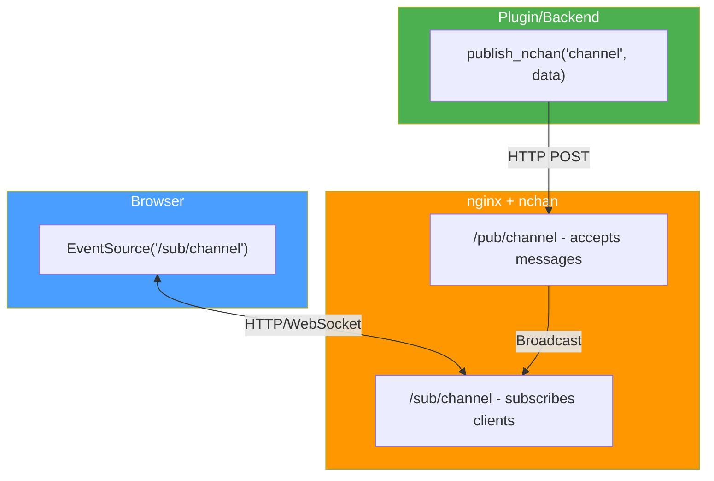

# nchan/WebSocket Integration

## Overview

Unraid uses [nchan](https://nchan.io/) for real-time updates via WebSockets and Server-Sent Events (SSE). This allows plugins to push updates to the browser without polling, enabling responsive UIs that update instantly when system state changes.

## Architecture



{: .placeholder-image }
> 📷 **Screenshot needed:** *Browser DevTools Network tab showing a WebSocket or EventSource connection to an Unraid nchan channel*
>
> 

## Subscribing to Channels (Client-Side)

### Using EventSource (SSE)

```javascript
// Subscribe to a channel using Server-Sent Events
var eventSource = new EventSource('/sub/yourplugin');

eventSource.onmessage = function(event) {
    var data = JSON.parse(event.data);
    console.log('Received:', data);
    
    // Update your UI
    updateStatus(data);
};

eventSource.onerror = function(event) {
    console.error('EventSource error:', event);
    // Handle reconnection
    setTimeout(function() {
        // EventSource automatically reconnects
    }, 5000);
};

// Clean up when leaving the page
window.addEventListener('beforeunload', function() {
    eventSource.close();
});
```

### Using WebSocket

```javascript
// Alternative: Using WebSocket directly
var ws = new WebSocket('ws://' + location.host + '/sub/yourplugin');

ws.onopen = function() {
    console.log('WebSocket connected');
};

ws.onmessage = function(event) {
    var data = JSON.parse(event.data);
    updateStatus(data);
};

ws.onclose = function() {
    console.log('WebSocket closed, reconnecting...');
    setTimeout(connectWebSocket, 5000);
};

ws.onerror = function(error) {
    console.error('WebSocket error:', error);
};
```

### Subscribing to Multiple Channels

```javascript
// Subscribe to multiple channels
var channels = ['diskstatus', 'dockerstatus', 'yourplugin'];
var sources = {};

channels.forEach(function(channel) {
    sources[channel] = new EventSource('/sub/' + channel);
    sources[channel].onmessage = function(event) {
        handleMessage(channel, JSON.parse(event.data));
    };
});

function handleMessage(channel, data) {
    switch(channel) {
        case 'diskstatus':
            updateDiskStatus(data);
            break;
        case 'yourplugin':
            updatePluginStatus(data);
            break;
    }
}
```

## Publishing to Channels (Server-Side)

### Using curl (Shell)

```bash
#!/bin/bash
# Publish a message to nchan channel

CHANNEL="yourplugin"
MESSAGE='{"status":"updated","value":42}'

curl -s -X POST "http://localhost/pub/$CHANNEL" \
    -H "Content-Type: application/json" \
    -d "$MESSAGE"
```

### Using PHP

```php
<?
/**
 * Publish a message to an nchan channel
 * 
 * @param string $channel Channel name
 * @param mixed $data Data to publish (will be JSON encoded)
 * @return bool Success
 */
function publish_nchan($channel, $data) {
    $url = "http://localhost/pub/$channel";
    $json = is_string($data) ? $data : json_encode($data);
    
    $ch = curl_init($url);
    curl_setopt_array($ch, [
        CURLOPT_POST => true,
        CURLOPT_POSTFIELDS => $json,
        CURLOPT_HTTPHEADER => ['Content-Type: application/json'],
        CURLOPT_RETURNTRANSFER => true,
        CURLOPT_TIMEOUT => 5
    ]);
    
    $result = curl_exec($ch);
    $success = curl_getinfo($ch, CURLINFO_HTTP_CODE) == 200;
    curl_close($ch);
    
    return $success;
}

// Usage
publish_nchan('yourplugin', [
    'status' => 'updated',
    'timestamp' => time(),
    'data' => $someData
]);
?>
```

### Using file_get_contents (Simpler)

```php
<?
function publish_nchan_simple($channel, $data) {
    $json = is_string($data) ? $data : json_encode($data);
    
    $context = stream_context_create([
        'http' => [
            'method' => 'POST',
            'header' => "Content-Type: application/json\r\n",
            'content' => $json,
            'timeout' => 5
        ]
    ]);
    
    return @file_get_contents("http://localhost/pub/$channel", false, $context);
}
?>
```

## Built-in Channels

Unraid provides several built-in channels that plugins can subscribe to:

| Channel | Description | Data Format |
|---------|-------------|-------------|
| `/sub/diskload` | Disk I/O statistics | Disk read/write stats |
| `/sub/cpuload` | CPU usage | CPU percentage array |
| `/sub/var` | System variable updates | var.ini changes |
| `/sub/disks` | Disk status changes | Disk state changes |
| `/sub/shares` | Share updates | Share modifications |
| `/sub/notify` | Notification updates | New notifications |
| `/sub/session` | Session status | Login/logout events |

### Subscribing to Built-in Channels

```javascript
// Monitor disk activity
var diskSource = new EventSource('/sub/diskload');
diskSource.onmessage = function(event) {
    var disks = JSON.parse(event.data);
    // disks contains read/write stats per disk
    updateDiskGraph(disks);
};

// Monitor system variables
var varSource = new EventSource('/sub/var');
varSource.onmessage = function(event) {
    var data = JSON.parse(event.data);
    // data contains changed var.ini values
    if (data.fsState) {
        updateArrayStatus(data.fsState);
    }
};
```

## Creating Custom Channels

### Channel Naming

Use your plugin name as the channel prefix to avoid conflicts:

```
/sub/yourplugin           # Main channel
/sub/yourplugin_status    # Status updates
/sub/yourplugin_logs      # Log streaming
```

### Channel Configuration

nchan channels are automatically created on first publish or subscribe. No configuration needed for basic usage.

## Real-Time Dashboard Example

### PHP Backend (status.php)

```php
<?
// /plugins/yourplugin/include/status.php

function getStatus() {
    // Gather status data
    return [
        'running' => isServiceRunning(),
        'tasks' => getActiveTasks(),
        'lastRun' => getLastRunTime(),
        'updated' => time()
    ];
}

function broadcastStatus() {
    $status = getStatus();
    publish_nchan('yourplugin_status', $status);
}
?>
```

### JavaScript Frontend

```html
<div id="status">
    <span id="running-status">Unknown</span>
    <span id="task-count">-</span>
    <span id="last-update">Never</span>
</div>

<script>
$(function() {
    var statusSource = new EventSource('/sub/yourplugin_status');
    
    statusSource.onmessage = function(event) {
        var status = JSON.parse(event.data);
        
        $('#running-status').text(status.running ? 'Running' : 'Stopped')
            .css('color', status.running ? 'green' : 'red');
        $('#task-count').text(status.tasks + ' tasks');
        $('#last-update').text('Updated ' + new Date(status.updated * 1000).toLocaleTimeString());
    };
    
    statusSource.onerror = function() {
        $('#running-status').text('Connection lost').css('color', 'orange');
    };
});
</script>
```

## Reconnection Handling

### Automatic Reconnection with EventSource

EventSource automatically reconnects on disconnection. To customize:

```javascript
var eventSource;
var reconnectDelay = 1000;
var maxDelay = 30000;

function connect() {
    eventSource = new EventSource('/sub/yourplugin');
    
    eventSource.onopen = function() {
        console.log('Connected');
        reconnectDelay = 1000;  // Reset delay on success
    };
    
    eventSource.onmessage = function(event) {
        handleMessage(JSON.parse(event.data));
    };
    
    eventSource.onerror = function() {
        eventSource.close();
        
        // Exponential backoff
        console.log('Reconnecting in ' + reconnectDelay + 'ms');
        setTimeout(connect, reconnectDelay);
        reconnectDelay = Math.min(reconnectDelay * 2, maxDelay);
    };
}

connect();
```

### Heartbeat Pattern

Implement heartbeat to detect stale connections:

```javascript
var lastMessage = Date.now();
var heartbeatInterval = setInterval(function() {
    if (Date.now() - lastMessage > 60000) {
        console.log('No message in 60s, reconnecting...');
        eventSource.close();
        connect();
    }
}, 30000);

eventSource.onmessage = function(event) {
    lastMessage = Date.now();
    // Handle message
};
```

## Best Practices

### 1. Throttle Updates

Don't publish too frequently:

```php
<?
$lastPublish = 0;
$minInterval = 1;  // Minimum 1 second between updates

function throttledPublish($channel, $data) {
    global $lastPublish, $minInterval;
    
    $now = time();
    if ($now - $lastPublish >= $minInterval) {
        publish_nchan($channel, $data);
        $lastPublish = $now;
    }
}
?>
```

### 2. Batch Updates

Combine multiple small updates:

```php
<?
$pendingUpdates = [];

function queueUpdate($key, $value) {
    global $pendingUpdates;
    $pendingUpdates[$key] = $value;
}

function flushUpdates() {
    global $pendingUpdates;
    if (!empty($pendingUpdates)) {
        publish_nchan('yourplugin', $pendingUpdates);
        $pendingUpdates = [];
    }
}

// Call flushUpdates() periodically or at end of script
?>
```

### 3. Handle Offline State

```javascript
var isOnline = navigator.onLine;

window.addEventListener('online', function() {
    isOnline = true;
    connect();  // Reconnect when back online
});

window.addEventListener('offline', function() {
    isOnline = false;
    eventSource.close();
});
```

### 4. Clean Up Resources

```javascript
// Clean up when leaving page
window.addEventListener('beforeunload', function() {
    if (eventSource) {
        eventSource.close();
    }
    clearInterval(heartbeatInterval);
});
```

## Debugging

### Check Channel Status

```bash
# Check if nchan is receiving messages
curl -s "http://localhost/pub/yourplugin?action=info"
```

### Monitor Messages

```bash
# Subscribe from command line to see messages
curl -s -N "http://localhost/sub/yourplugin"
```

### Browser Developer Tools

1. Open Network tab
2. Filter by "EventSource" or "WS"
3. Watch messages in real-time

## Related Topics

- [JavaScript Patterns](../ui/javascript-patterns.md)
- [Dashboard Tiles](../ui/dashboard-tiles.md)
- [Cron Jobs](cron-jobs.md) - For periodic status broadcasts

## References

- [nchan documentation](https://nchan.io/)
- [MDN EventSource](https://developer.mozilla.org/en-US/docs/Web/API/EventSource)
- [MDN WebSocket](https://developer.mozilla.org/en-US/docs/Web/API/WebSocket)
