# Event System

{: .note }
> ✅ **Validated against Unraid 7.2.3** - Event names and execution order verified against `/usr/local/sbin/emhttp_event`.

Unraid plugins can respond to system events by placing executable scripts in their `event/` directory. This allows plugins to perform actions when the array starts, Docker launches, or the system is shutting down.

## How Events Work

The `emhttp` process calls `/usr/local/sbin/emhttp_event` when system events occur. This script then looks for and executes event handlers in each plugin's `event/` directory.

> ⚠️ **Caution**: The emhttp process **blocks** until all event scripts complete. Long-running scripts will delay system operations. Use background processes for lengthy tasks.

## Event Execution Order

For each event, scripts are executed in this order:

1. **any_event handlers** - Scripts in `event/any_event/` or `event/any_event` receive ALL events
2. **Specific event handlers** - Scripts matching the event name

Plugins are processed alphabetically by plugin name.

## Available Events

### Startup Events

| Event | Description | When to Use |
|-------|-------------|-------------|
| `driver_loaded` | Early initialization, INI files are valid | Load kernel modules |
| `starting` | Array start begins | Pre-start preparation |
| `array_started` | Array devices (`/dev/md*`) are valid | Access array devices |
| `disks_mounted` | Disks and user shares are mounted | Access `/mnt/user/` |
| `svcs_restarted` | Network services started/restarted | Configure network services |
| `docker_started` | Docker service is running | Start Docker containers |
| `libvirt_started` | VM service is running | Start VMs |
| `started` | Array start complete | Most common - general startup |

### Shutdown Events

| Event | Description | When to Use |
|-------|-------------|-------------|
| `stopping` | Array stop begins | Pre-shutdown tasks |
| `stopping_libvirt` | About to stop VMs | Gracefully stop VMs |
| `stopping_docker` | About to stop Docker | Stop Docker containers |
| `stopping_svcs` | About to stop network services | Cleanup network resources |
| `unmounting_disks` | Disks about to unmount | Final disk access |
| `stopping_array` | Disks unmounted, array stopping | Last chance before stopped |
| `stopped` | Array fully stopped | Post-stop cleanup |

```mermaid
flowchart LR
    subgraph Startup["Array Start Sequence"]
        direction TB
        S1[driver_loaded] --> S2[starting]
        S2 --> S3[array_started]
        S3 --> S4[disks_mounted]
        S4 --> S5[svcs_restarted]
        S5 --> S6[docker_started]
        S6 --> S7[libvirt_started]
        S7 --> S8[started]
    end
    
    subgraph Shutdown["Array Stop Sequence"]
        direction TB
        P1[stopping] --> P2[stopping_libvirt]
        P2 --> P3[stopping_docker]
        P3 --> P4[stopping_svcs]
        P4 --> P5[unmounting_disks]
        P5 --> P6[stopping_array]
        P6 --> P7[stopped]
    end
    
    Startup -.->|🔄 Reboot/Stop| Shutdown
    
    style S8 fill:#4caf50,color:#fff
    style P7 fill:#f44336,color:#fff
```



{: .placeholder-image }
> 📷 **Screenshot needed:** *Syslog output showing event/plugin messages*
>
> 

### Other Events

| Event | Description | When to Use |
|-------|-------------|-------------|
| `poll_attributes` | SMART data has been polled | Monitor disk health |

## Creating Event Handlers

{: .note }
> See the [DocTest validation plugin event handlers](https://github.com/mstrhakr/unraid-plugin-docs/blob/main/validation/plugin/source/emhttp/event/) for working examples of all 16 documented events.

### Directory Structure

Place event handler scripts in your plugin's `event/` directory. You can use either a single executable file named after the event, or a directory containing multiple numbered scripts that run in alphabetical order.

```
/usr/local/emhttp/plugins/myplugin/
└── event/
    ├── started           # Single script for 'started' event
    ├── stopping_docker   # Single script for 'stopping_docker' event
    └── any_event/        # Directory for scripts that handle ALL events
        └── logger.sh
```

You can use either:
- A single executable file named after the event
- A directory containing multiple scripts

### Basic Event Script

Create an executable script at `event/started`:

```bash
#!/bin/bash
# event/started - Runs when the array has fully started

# Source configuration
source /usr/local/emhttp/plugins/myplugin/default.cfg
source /boot/config/plugins/myplugin/myplugin.cfg 2>/dev/null

# Log that we're starting
logger "myplugin: Array started, initializing..."

# Do your startup tasks here
# ...

# For long-running tasks, background them
/usr/local/emhttp/plugins/myplugin/scripts/background_task.sh &

logger "myplugin: Initialization complete"
```

### Event Script Arguments

All event scripts receive the event name as the first argument:

```bash
#!/bin/bash
# event/any_event - Handles all events

EVENT_NAME="$1"

case "$EVENT_NAME" in
    started)
        logger "myplugin: Array started"
        ;;
    stopping)
        logger "myplugin: Array stopping"
        ;;
    *)
        # Ignore other events
        ;;
esac
```

## Common Patterns

### Starting Services on Array Start

```bash
#!/bin/bash
# event/started

source /boot/config/plugins/myplugin/myplugin.cfg 2>/dev/null

# Only start if enabled in settings
if [ "${SERVICE_ENABLED}" = "true" ]; then
    logger "myplugin: Starting service..."
    /usr/local/emhttp/plugins/myplugin/scripts/start_service.sh &
fi
```

### Autostarting Docker Compose Stacks

Real-world example from Compose Manager:

```bash
#!/bin/bash
# event/started

source /usr/local/emhttp/plugins/compose.manager/default.cfg
source /boot/config/plugins/compose.manager/compose.manager.cfg

COMPOSE_ROOT=$PROJECTS_FOLDER
COMPOSE_WRAPPER=/usr/local/emhttp/plugins/compose.manager/scripts/compose.sh

# Process each project directory
for dir in $COMPOSE_ROOT/*; do
    if [ -d "$dir" ]; then
        if [ -f "$dir/docker-compose.yml" ]; then
            if [ -f "$dir/autostart" ]; then
                name=$(< "${dir}/name")
                logger "Starting compose stack: ${name}"
                $COMPOSE_WRAPPER -c up -d "${dir}" &
            fi
        fi
    fi
done
```

### Graceful Shutdown

```bash
#!/bin/bash
# event/stopping_docker

source /usr/local/emhttp/plugins/myplugin/default.cfg
source /boot/config/plugins/myplugin/myplugin.cfg

# Stop all managed containers gracefully
for container in $MANAGED_CONTAINERS; do
    logger "myplugin: Stopping container ${container}"
    docker stop "$container" 2>/dev/null
done
```

### Handling Multiple Scripts

If you need multiple scripts for one event, use a directory. Prefix script names with numbers to control execution order—scripts run in alphabetical order, so `01-load-config.sh` runs before `02-start-services.sh`.

```
event/
└── started/
    ├── 01-load-config.sh
    ├── 02-start-services.sh
    └── 03-notify.sh
```

Scripts are executed in alphabetical order.

## Best Practices

### 1. Keep Scripts Fast

The emhttp process waits for event scripts to complete. For long tasks:

```bash
#!/bin/bash
# Bad - blocks emhttp
sleep 60
do_long_task

# Good - runs in background
do_long_task &
```

### 2. Use Logger for Debugging

Log messages appear in `/var/log/syslog`:

```bash
logger "myplugin: Event $1 received"
logger -t myplugin "More specific tag"
```

View with: `tail -f /var/log/syslog | grep myplugin`

### 3. Handle Missing Config Gracefully

```bash
#!/bin/bash
# Source config files safely
source /usr/local/emhttp/plugins/myplugin/default.cfg

# User config might not exist yet
if [ -f /boot/config/plugins/myplugin/myplugin.cfg ]; then
    source /boot/config/plugins/myplugin/myplugin.cfg
fi
```

### 4. Check Dependencies

```bash
#!/bin/bash
# event/started

# Only run if Docker is actually running
if ! docker info &>/dev/null; then
    logger "myplugin: Docker not running, skipping startup"
    exit 0
fi

# Proceed with Docker-dependent tasks
```

### 5. Make Scripts Executable

In your package build script:

```bash
chmod +x /path/to/plugin/event/*
chmod +x /path/to/plugin/event/started
```

### 6. Be Idempotent

Scripts may run multiple times (reboots, manual array start/stop):

```bash
#!/bin/bash
# event/started

PIDFILE=/var/run/myplugin.pid

# Check if already running
if [ -f "$PIDFILE" ] && kill -0 $(cat "$PIDFILE") 2>/dev/null; then
    logger "myplugin: Already running"
    exit 0
fi

# Start the service
start_my_service &
echo $! > "$PIDFILE"
```

## Testing Events

### Manually Trigger Events

You can simulate events for testing:

```bash
# Simulate the 'started' event
/usr/local/sbin/emhttp_event started

# Watch syslog for output
tail -f /var/log/syslog | grep myplugin
```

### Test Without Rebooting

During development, you can directly execute your script:

```bash
# Run your event script directly
/usr/local/emhttp/plugins/myplugin/event/started
```

### Check for Errors

```bash
# Run with bash debugging
bash -x /usr/local/emhttp/plugins/myplugin/event/started
```

## Reference: emhttp_event Script

Here's the core logic from `/usr/local/sbin/emhttp_event`:

```bash
#!/bin/bash
# Invoke all 'any_event' scripts that might exist
for Dir in /usr/local/emhttp/plugins/* ; do
  if [ -d $Dir/event/any_event ]; then
    for File in $Dir/event/any_event/* ; do
      if [ -x $File ]; then
        $File "$@"
      fi
    done
  elif [ -x $Dir/event/any_event ]; then
    $Dir/event/any_event "$@"
  fi
done

# Invoke specific event scripts that might exist for this event
for Dir in /usr/local/emhttp/plugins/* ; do
  if [ -d $Dir/event/$1 ]; then
    for File in $Dir/event/$1/* ; do
      if [ -x $File ]; then
        $File "$@"
      fi
    done
  elif [ -x $Dir/event/$1 ]; then
    $Dir/event/$1 "$@"
  fi
done
```

## Next Steps

- Learn about [Page Files](page-files.md) for creating the web UI
- See [Shell Scripts](shell-scripts.md) for more scripting patterns
- Check [Best Practices](best-practices.md) for additional tips
