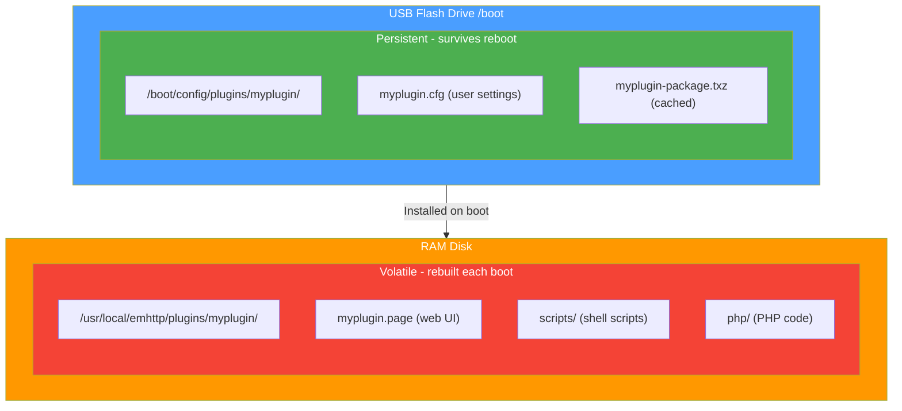

# File System Layout

{: .note }
> ✅ **Validated against Unraid 7.2.3** - Directory structures and paths verified on live systems.

Understanding where files are stored and why is crucial for Unraid plugin development. Unraid runs from RAM, which creates unique challenges and opportunities.

## The RAM-Based Architecture

Unraid boots from a USB flash drive into RAM. This means:

- **Changes to most files are lost on reboot**
- **The USB flash drive is the only persistent storage during boot**
- **Plugins must be reinstalled on every boot**



{: .placeholder-image }
> 📷 **Screenshot needed:** *File listing of /boot/config/plugins/ directory*
>
> 

## Key Directories

### /boot/config/plugins/

**Location**: USB Flash Drive  
**Persistence**: ✅ Survives reboot

This is where plugin files are stored on the boot device:

```
/boot/config/plugins/
├── myplugin.plg                    # The plugin installer file
├── myplugin/                       # Plugin's persistent storage
│   ├── myplugin.cfg               # User configuration
│   ├── myplugin-package-1.0.txz   # Cached package (optional)
│   └── data/                      # Plugin data files
└── [other-plugins...]
```

**Use for:**
- User configuration files
- Cached downloads (packages, icons)
- Small data files that must persist
- State files

**Avoid:**
- Large data files (limited USB space)
- Frequently written files (USB wear)
- Log files

{: .placeholder-image }
> 📷 **Screenshot needed:** *File listing of /boot/config/plugins/ directory*
>
> 

### /usr/local/emhttp/plugins/

**Location**: RAM Disk  
**Persistence**: ❌ Rebuilt on boot

This is where active plugin files live:

```
/usr/local/emhttp/plugins/myplugin/
├── myplugin.page                  # Main UI page
├── myplugin.settings.page         # Settings page
├── default.cfg                    # Default configuration
├── README.md                      # Shown in Plugin Manager
├── php/
│   ├── exec.php                   # AJAX endpoint
│   └── helpers.php                # Utility functions
├── scripts/
│   ├── start.sh                   # Service start script
│   └── status.sh                  # Status check
├── event/
│   ├── started                    # Array started handler
│   └── stopping_docker            # Pre-Docker-stop handler
├── javascript/
│   └── custom.js                  # Client-side scripts
└── styles/
    └── custom.css                 # Plugin styles
```

**Contains:**
- Web UI pages (`.page` files)
- PHP scripts
- Shell scripts
- Event handlers
- Static assets (JS, CSS, images)
- Default configuration

{: .placeholder-image }
> 📷 **Screenshot needed:** *File listing of /usr/local/emhttp/plugins/ structure*
>
> 

### /var/log/plugins/

**Location**: RAM Disk  
**Persistence**: ❌ Cleared on reboot

Contains symlinks indicating which plugins are installed:

```
/var/log/plugins/
├── myplugin.plg -> /boot/config/plugins/myplugin.plg
└── [other-plugins.plg...]
```

The plugin manager checks this directory to know what's installed.

### /tmp/plugins/

**Location**: RAM Disk  
**Persistence**: ❌ Temporary

Used during plugin operations:

- Downloaded plugin files for updates
- Temporary extraction location

### /boot/config/plugins-*/

**Special directories** on the USB flash:

| Directory | Purpose |
|-----------|---------|
| `/boot/config/plugins/` | Active plugins |
| `/boot/config/plugins-error/` | Plugins that failed to install |
| `/boot/config/plugins-removed/` | Uninstalled plugins |
| `/boot/config/plugins-stale/` | Superseded plugin versions |

## Data Storage Options

### For Configuration

Store user settings on the USB flash:

```
/boot/config/plugins/myplugin/myplugin.cfg
```

**Format:**
```ini
SETTING_ONE="value"
SETTING_TWO="another value"
ENABLED="true"
```

**Reading in PHP:**
```php
$cfg = parse_plugin_cfg('myplugin');
echo $cfg['SETTING_ONE'];
```

### For Application Data

For larger data that needs to persist:

**Option 1: User Share (Recommended)**
```
/mnt/user/appdata/myplugin/
```

**Option 2: Cache Drive**
```
/mnt/cache/appdata/myplugin/
```

**Option 3: Array Share**
```
/mnt/user/myplugin-data/
```

### For Logs

Use the system logger (writes to RAM, available in syslog):

```bash
logger "myplugin: Your log message"
logger -t myplugin "Tagged message"
```

Or write to a temporary file:
```bash
echo "Log message" >> /tmp/myplugin.log
```

### For Runtime State

For PID files, state tracking:

```bash
# PID file
/var/run/myplugin.pid

# Lock files
/var/lock/myplugin.lock

# Temporary state
/tmp/myplugin/
```

## File Permissions

### Package Files

When building your package:

```bash
# Make scripts executable
chmod +x scripts/*.sh
chmod +x event/*

# Standard file permissions
chmod 644 *.page
chmod 644 *.cfg
chmod 644 php/*.php

# Make PHP exec scripts executable
chmod +x php/exec.php
```

### Configuration Files

User config files on flash:

```bash
# Secure user config
chmod 600 /boot/config/plugins/myplugin/myplugin.cfg
```

## Package Directory Structure

Your `.txz` package should extract to mirror the emhttp structure:

```
[package root]/
└── usr/
    └── local/
        └── emhttp/
            └── plugins/
                └── myplugin/
                    ├── myplugin.page
                    ├── default.cfg
                    └── [other files]
```

Additional files can go elsewhere:

```
[package root]/
├── usr/
│   ├── local/
│   │   ├── emhttp/
│   │   │   └── plugins/
│   │   │       └── myplugin/
│   │   └── bin/
│   │       └── mytool           # CLI utility
│   └── lib/
│       └── docker/
│           └── cli-plugins/
│               └── docker-myplugin  # Docker CLI plugin
└── install/
    └── slack-desc               # Package description
```

## Best Practices

### 1. Minimize USB Writes

The USB flash has limited write cycles:

```bash
# Bad - writes on every call
echo "$value" > /boot/config/plugins/myplugin/counter.txt

# Good - write to RAM, sync occasionally
echo "$value" > /tmp/myplugin/counter.txt
# Only sync to flash on shutdown or periodically
```

### 2. Use Symlinks Wisely

Link from flash to RAM for frequently accessed data:

```bash
# During install script
if [ ! -L /boot/config/plugins/myplugin/logs ]; then
    mkdir -p /tmp/myplugin/logs
    ln -s /tmp/myplugin/logs /boot/config/plugins/myplugin/logs
fi
```

### 3. Handle Missing Directories

Files on flash may not exist on first install:

```bash
#!/bin/bash
# Create directories if needed
mkdir -p /boot/config/plugins/myplugin

# Source config with fallback
if [ -f /boot/config/plugins/myplugin/myplugin.cfg ]; then
    source /boot/config/plugins/myplugin/myplugin.cfg
fi
```

### 4. Clean Up on Remove

In your remove script:

```bash
# Remove plugin files
rm -rf /boot/config/plugins/myplugin

# Remove runtime files
rm -rf /tmp/myplugin
rm -f /var/run/myplugin.pid

# Remove the package
removepkg myplugin-package
```

### 5. Document Data Locations

In your README, tell users where data is stored:

```markdown
## Data Locations

- **Configuration**: `/boot/config/plugins/myplugin/myplugin.cfg`
- **Application Data**: `/mnt/user/appdata/myplugin/`
- **Logs**: Check syslog with `grep myplugin /var/log/syslog`
```

## Troubleshooting

### Files Missing After Reboot

**Problem**: Custom files in `/usr/local/emhttp/plugins/` disappear after reboot.

**Solution**: Files must be in your `.txz` package or created by an install script.

### Config Not Saving

**Problem**: Settings don't persist.

**Solution**: Verify the form writes to `/boot/config/plugins/yourplugin/`:
```html
<input type="hidden" name="#file" value="myplugin/myplugin.cfg">
```

### Out of Space on Flash

**Problem**: USB flash drive is full.

**Solution**: 
1. Clean `/boot/config/plugins-removed/`
2. Clean `/boot/config/plugins-stale/`
3. Move large data to array shares
4. Remove cached packages you don't need

## Next Steps

- Learn about [PLG File Structure](plg-file.md) for installation
- See [Packaging](packaging.md) for creating `.txz` packages
- Check [Configuration Files](config-files.md) for settings management
