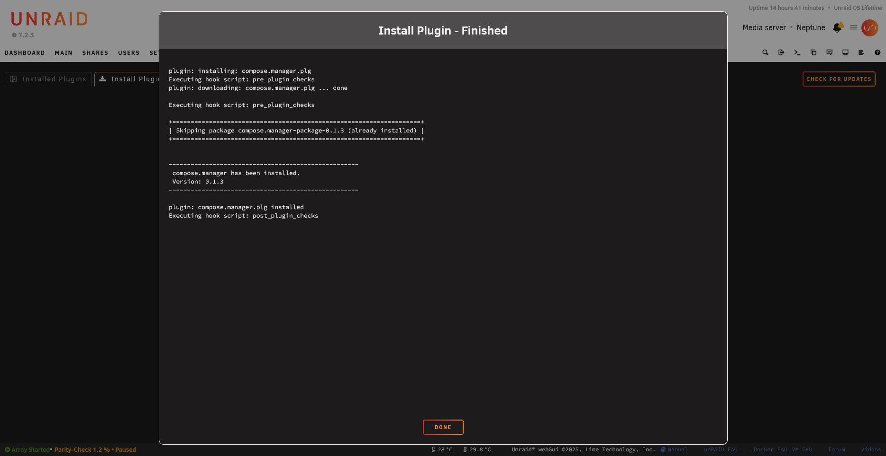

# Getting Started: Your First Plugin

{: .note }
> Unraid® is a registered trademark of Lime Technology, Inc. This documentation is not affiliated with Lime Technology, Inc.

This tutorial walks you through creating a simple "Hello World" Unraid plugin. You can follow along step-by-step to understand how plugins are structured, or start from a template repository to move faster.

## Template Repository
https://github.com/dkaser/unraid-plugin-template

## What We'll Build

A minimal plugin that:
- Adds a page to the Unraid Settings menu
- Shows a simple message
- Has a configurable setting

{: .placeholder-image }
> 📷 **Screenshot needed:** *A plugin settings page showing form styling*
>
> 

## Prerequisites

- A working Unraid server (for testing)
- Basic knowledge of PHP, HTML, and bash scripting
- A text editor
- A way to host files (GitHub works great)

## Step 1: Plan Your Plugin

Before writing code, decide on:

| Item | Our Choice | Notes |
|------|------------|-------|
| Plugin name | `hello.world` | Lowercase, no spaces |
| Menu location | Settings | Could also be Tools, Utilities |
| Features | Show message, one setting | Keep it simple |

## Step 2: Create the Package Structure

Create this directory structure. The `source/` folder mirrors the final filesystem layout—files under `usr/local/emhttp/plugins/` will be installed to that exact location on Unraid. The PLG file and build script stay at the root level.

```
hello.world/
├── source/
│   └── usr/
│       └── local/
│           └── emhttp/
│               └── plugins/
│                   └── hello.world/
│                       ├── hello.world.page
│                       ├── default.cfg
│                       └── README.md
├── hello.world.plg
└── pkg_build.sh
```

## Step 3: Create the Web UI Page

**`source/usr/local/emhttp/plugins/hello.world/hello.world.page`**:

```php
Menu="Settings"
Title="Hello World"
Icon="globe"
---
<?php
$plugin = "hello.world";
$cfg = parse_plugin_cfg($plugin);
?>

<h2>Hello World Plugin</h2>

<p>Your message: <strong><?=$cfg['MESSAGE']?></strong></p>

<form markdown="1" method="POST" action="/update.php" target="progressFrame">
<input type="hidden" name="#file" value="<?=$plugin?>/<?=$plugin?>.cfg">

_(Your Message)_:
: <input type="text" name="MESSAGE" value="<?=$cfg['MESSAGE']?>" placeholder="Enter a message">

<blockquote class="inline_help">
Enter a custom message to display.
</blockquote>

<input type="submit" name="#default" value="_(Default)_">
: <input type="submit" name="#apply" value="_(Apply)_" disabled><input type="button" value="_(Done)_" onclick="done()">
</form>
```

## Step 4: Create Default Configuration

**`source/usr/local/emhttp/plugins/hello.world/default.cfg`**:

```ini
MESSAGE="Hello from my first plugin!"
```

## Step 5: Create the README

**`source/usr/local/emhttp/plugins/hello.world/README.md`**:

```markdown
**Hello World Plugin**

A simple example plugin for learning Unraid plugin development.

**Features:**
- Configurable greeting message
- Settings page demonstration
```

## Step 6: Create the Build Script

**`pkg_build.sh`**:

```bash
#!/bin/bash
VERSION=${1:-"2026.02.01"}
PKG_NAME="hello.world-package-${VERSION}"

# Create temp directory
TMPDIR=$(mktemp -d)
mkdir -p "${TMPDIR}/install"

# Copy source files
cp -R source/* "${TMPDIR}/"

# Create package description
cat > "${TMPDIR}/install/slack-desc" << EOF
hello.world: Hello World Plugin for Unraid
hello.world:
hello.world: A simple example plugin demonstrating Unraid
hello.world: plugin development basics.
hello.world:
EOF

# Build the package
cd "${TMPDIR}"
makepkg -l y -c y "../${PKG_NAME}.txz"
cd ..

# Cleanup
rm -rf "${TMPDIR}"

# Calculate MD5
md5sum "${PKG_NAME}.txz"
```

## Step 7: Create the PLG File

**`hello.world.plg`**:

```xml
<?xml version='1.0' standalone='yes'?>
<!DOCTYPE PLUGIN [
<!ENTITY name        "hello.world">
<!ENTITY author      "Your Name">
<!ENTITY version     "2026.02.01">
<!ENTITY launch      "Settings/hello.world">
<!ENTITY pluginURL   "https://raw.githubusercontent.com/YOURUSER/hello.world/main/hello.world.plg">
<!ENTITY packageURL  "https://github.com/YOURUSER/hello.world/releases/download/&version;/hello.world-package-&version;.txz">
<!ENTITY packageMD5  "YOUR_MD5_HERE">
<!ENTITY pluginLOC   "/boot/config/plugins/&name;">
]>

<PLUGIN  name="&name;"
         author="&author;"
         version="&version;"
         launch="&launch;"
         pluginURL="&pluginURL;"
         icon="globe"
         min="6.9.0"
>

<CHANGES>
### &version;
- Initial release
</CHANGES>

<!-- PRE-INSTALL -->
<FILE Run="/bin/bash">
<INLINE>
mkdir -p &pluginLOC;
rm -f $(ls &pluginLOC;/*.txz 2>/dev/null)
</INLINE>
</FILE>

<!-- INSTALL PACKAGE -->
<FILE Name="&pluginLOC;/hello.world-package-&version;.txz" Run="upgradepkg --install-new">
<URL>&packageURL;</URL>
<MD5>&packageMD5;</MD5>
</FILE>

<!-- POST-INSTALL -->
<FILE Run="/bin/bash">
<INLINE>
echo ""
echo "-------------------------------------------"
echo " &name; has been installed."
echo " Version: &version;"
echo "-------------------------------------------"
echo ""
</INLINE>
</FILE>

<!-- REMOVE -->
<FILE Run="/bin/bash" Method="remove">
<INLINE>
removepkg hello.world-package-&version;
rm -rf &pluginLOC;
</INLINE>
</FILE>

</PLUGIN>
```

## Step 8: Build and Test

### Build the Package

On an Unraid server (or Linux with makepkg):

```bash
chmod +x pkg_build.sh
./pkg_build.sh 2026.02.01
```

Note the MD5 output and update your PLG file.

### Test Locally

1. Copy files to your Unraid server
2. Install manually:
   ```bash
   plugin install /path/to/hello.world.plg
   ```
3. Check for errors in the console output
4. Navigate to Settings → Hello World



The success message confirms your plugin installed correctly:

{: .crop-pluginsComplete-message }

### Test Changes Without Reinstalling

Edit files directly on the server:
```bash
nano /usr/local/emhttp/plugins/hello.world/hello.world.page
```

Refresh the browser to see changes. Remember to copy changes back to your source!

## Step 9: Publish

1. Create a GitHub repository
2. Upload your source files
3. Create a release with the `.txz` package
4. Update the PLG file URLs
5. Share your plugin!

{: .placeholder-image }
> 📷 **Screenshot needed:** *GitHub releases page with plugin assets*
>
> 

## Common Issues

### Page Doesn't Appear

- Check Menu attribute is valid
- Verify PHP syntax: `php -l hello.world.page`
- Check `/var/log/syslog` for errors

### Settings Don't Save

- Verify `#file` hidden input path
- Check config directory exists

### Package Won't Install

- Verify MD5 checksum matches
- Check package URL is accessible
- Look at install output for errors

### "Bad Interpreter" Error

If you see errors like `/bin/bash^M: bad interpreter`, your files have Windows line endings (CRLF). Fix with:

```bash
# Convert all scripts to Unix line endings
find . -type f \( -name "*.sh" -o -name "*.page" \) -exec sed -i 's/\r$//' {} \;
```

{: .warning }
> **Windows developers**: Always convert line endings before packaging! Add line ending conversion to your build script. See [Debugging Techniques](advanced/debugging-techniques.md#windows-line-endings-crlf-vs-lf) for details.

### Form Layout Issues

If form fields are misaligned, check that you're using the Dynamix markdown syntax with `: ` (colon-space at line start):

```markdown
_(Label)_:
: <input type="text" name="field">
```

**Not** raw `<dl><dt><dd>` HTML inside `markdown="1"` forms. See [Page Files Troubleshooting](page-files.md#content-shifted-or-layout-issues) for details.

## Next Steps

Now that you have a working plugin:

1. Read [PLG File Reference](plg-file.md) for advanced options
2. Learn [Page Files](page-files.md) for complex UIs
3. Explore [Events](events.md) for background automation
4. Study [Example Plugins](examples.md) for real-world patterns

Congratulations on your first Unraid plugin! 🎉
