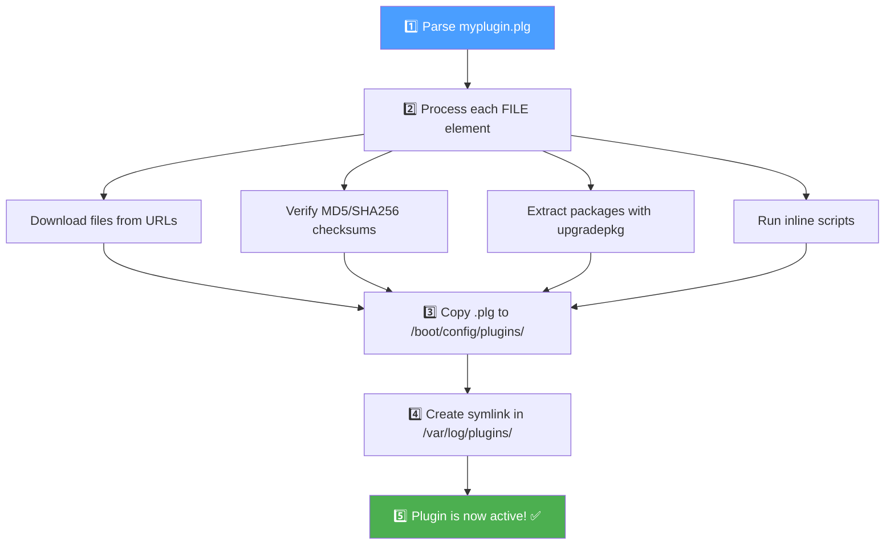

# Introduction to Unraid® Plugins

{: .note }
> Unraid® is a registered trademark of Lime Technology, Inc. This documentation is not affiliated with Lime Technology, Inc.

Extend your [Unraid®](https://unraid.net/) server with custom functionality.

## What is an Unraid® Plugin?

An Unraid® plugin is an extension that adds functionality to your Unraid® server. Plugins can:

- Add new pages to the web UI
- Install additional software packages
- Add background services and scripts
- Respond to system events (array start/stop, Docker events, etc.)
- Integrate with Docker and VM management
- Provide settings pages for configuration


Each plugin row shows the name, version, and available actions:

{: .crop-pluginsInstalled-row }

## How Plugins Work

The Unraid plugin system is built on top of Slackware's package management. When you install a plugin:

1. The `.plg` file is downloaded and processed
2. Any required packages (`.txz` files) are downloaded and extracted
3. Install scripts are executed
4. The plugin is registered as "installed"
5. On every reboot, installed plugins are automatically reinstalled

> ⚠️ **Important**: Unraid runs from RAM. The only persistent storage is the USB flash boot device. This is why plugins must be reinstalled on every boot.

## Plugin vs Docker Container

Before creating a plugin, consider whether your use case is better suited to a Docker container:

| Use Plugin When | Use Docker When |
|----------------|-----------------|
| Modifying the Unraid web UI | Running isolated applications |
| Deep system integration needed | Standard server software (Plex, etc.) |
| Responding to Unraid events | Software with complex dependencies |
| Installing kernel modules | Want easy updates/rollbacks |
| Very lightweight additions | Application doesn't need system access |

Many developers use a combination: a plugin that manages Docker containers (like the Compose Manager plugin).

## Anatomy of a Plugin

A complete plugin typically consists of:

### 1. The PLG File (`myplugin.plg`)

An XML file that defines:
- Plugin metadata (name, version, author, URLs)
- Files to download
- Installation scripts
- Removal scripts

### 2. The Package (`myplugin-package.txz`)

A Slackware-format package containing:
- Web UI pages (`.page` files)
- PHP scripts
- Shell scripts
- CSS and JavaScript
- Event handlers
- Default configuration

### 3. Configuration Storage

Plugin configuration is typically stored in:
```
/boot/config/plugins/myplugin/myplugin.cfg
```

This persists across reboots because it's on the USB flash drive.

## File Locations

Understanding where files live is crucial:

### On USB Flash (Persistent)

```
/boot/config/plugins/
├── myplugin.plg              # The plugin installer
└── myplugin/
    ├── myplugin.cfg          # User configuration
    ├── myplugin-package.txz  # The plugin package (optional caching)
    └── [other cached files]
```

### In RAM (Rebuilt on Boot)

```
/usr/local/emhttp/plugins/myplugin/
├── myplugin.page             # Main UI page
├── myplugin.settings.page    # Settings page
├── default.cfg               # Default configuration values
├── README.md                 # Shown in "Plugins" page
├── php/
│   └── [PHP files]
├── scripts/
│   └── [Shell scripts]
├── event/
│   ├── started               # Runs when array starts
│   └── stopping_docker       # Runs before Docker stops
└── [other resources]
```

### Plugin Registration

```
/var/log/plugins/myplugin.plg  # Symlink indicating plugin is installed
```

## The Installation Process

When `plugin install myplugin.plg` runs:



## What You'll Learn

This documentation will guide you through:

1. **[PLG File Structure](plg-file.md)** - How to write the plugin installer
2. **[Page Files](page-files.md)** - Creating the web UI
3. **[Event System](events.md)** - Responding to system events
4. **[Packaging](packaging.md)** - Building distribution packages
5. **[Best Practices](best-practices.md)** - Tips from experienced developers

## Working Example: DocTest Validation Plugin

This repository includes a complete, working validation plugin that demonstrates all documented features. You can:

- **[View the source code](https://github.com/mstrhakr/unraid-plugin-docs/tree/main/validation/plugin)** - See how a real plugin is structured
- **[Install it on your server](https://github.com/mstrhakr/unraid-plugin-docs/blob/main/validation/README.md)** - Test documented features live
- **[Check validation results](https://github.com/mstrhakr/unraid-plugin-docs/blob/main/validation/results/)** - See what we've verified against Unraid

The DocTest plugin validates:
- All 16 documented event handlers
- `parse_plugin_cfg()` and `mk_option()` functions
- `$var` array properties
- Page file rendering and form handling
- Notification system integration

## Next Steps

Ready to build your first plugin? Continue to [Your First Plugin](getting-started.md) for a hands-on tutorial.

## Learning Resources

The best way to learn Unraid plugin development is to study existing plugins:

### System Scripts

The `/usr/local/sbin/` directory contains many Unraid system scripts that demonstrate patterns:
- `emhttp_event` - How events are dispatched to plugins
- `notify` - Notification system internals
- Various utility scripts

### Reference Plugins

- **[Dynamix plugins](https://github.com/unraid/dynamix)** - Official Unraid plugins (the reference implementation)
- **[Community Applications](https://github.com/Squidly271/community.applications)** - Complex PHP patterns
- **[Compose Manager](https://github.com/dcflachs/compose_plugin)** - Docker Compose integration example

### Community Resources

- **[Unraid Forums - Plugin Support](https://forums.unraid.net/forum/index.php?board=45.0)** - Get help from the community
- **[Unraid Forums - Programming](https://forums.unraid.net/forum/index.php?board=79.0)** - Technical discussions

### Key Forum Threads

These foundational posts contain detailed plugin development information:

- [How does the plugin system work?](https://forums.unraid.net/topic/38582-how-does-the-plugin-system-work-documentation-added/) - Comprehensive PLG structure guide
- [Plugin System Documentation](https://forums.unraid.net/topic/52623-plugin-system-documentation/) - Links to essential resources
