# Introduction to Unraid Plugins

## What is an Unraid Plugin?

An Unraid plugin is an extension that adds functionality to your Unraid server. Plugins can:

- Add new pages to the web UI
- Install additional software packages
- Add background services and scripts
- Respond to system events (array start/stop, Docker events, etc.)
- Integrate with Docker and VM management
- Provide settings pages for configuration

{: .placeholder-image }
> 📷 **Screenshot needed:** *The Unraid Plugins page showing installed plugins*
>
> 

## How Plugins Work

The Unraid plugin system is built on top of Slackware's package management. When you install a plugin:

1. The `.plg` file is downloaded and processed
2. Any required packages (`.txz` files) are downloaded and extracted
3. Install scripts are executed
4. The plugin is registered as "installed"
5. On every reboot, installed plugins are automatically reinstalled

> ⚠️ **Important**: Unraid runs from RAM. The only persistent storage is the USB flash boot device. This is why plugins must be reinstalled on every boot.

## Plugin vs Docker Container

Before creating a plugin, consider whether your use case is better suited to a Docker container:

| Use Plugin When | Use Docker When |
|----------------|-----------------|
| Modifying the Unraid web UI | Running isolated applications |
| Deep system integration needed | Standard server software (Plex, etc.) |
| Responding to Unraid events | Software with complex dependencies |
| Installing kernel modules | Want easy updates/rollbacks |
| Very lightweight additions | Application doesn't need system access |

Many developers use a combination: a plugin that manages Docker containers (like the Compose Manager plugin).

## Anatomy of a Plugin

A complete plugin typically consists of:

### 1. The PLG File (`myplugin.plg`)

An XML file that defines:
- Plugin metadata (name, version, author, URLs)
- Files to download
- Installation scripts
- Removal scripts

### 2. The Package (`myplugin-package.txz`)

A Slackware-format package containing:
- Web UI pages (`.page` files)
- PHP scripts
- Shell scripts
- CSS and JavaScript
- Event handlers
- Default configuration

### 3. Configuration Storage

Plugin configuration is typically stored in:
```
/boot/config/plugins/myplugin/myplugin.cfg
```

This persists across reboots because it's on the USB flash drive.

## File Locations

Understanding where files live is crucial:

### On USB Flash (Persistent)

```
/boot/config/plugins/
├── myplugin.plg              # The plugin installer
└── myplugin/
    ├── myplugin.cfg          # User configuration
    ├── myplugin-package.txz  # The plugin package (optional caching)
    └── [other cached files]
```

### In RAM (Rebuilt on Boot)

```
/usr/local/emhttp/plugins/myplugin/
├── myplugin.page             # Main UI page
├── myplugin.settings.page    # Settings page
├── default.cfg               # Default configuration values
├── README.md                 # Shown in "Plugins" page
├── php/
│   └── [PHP files]
├── scripts/
│   └── [Shell scripts]
├── event/
│   ├── started               # Runs when array starts
│   └── stopping_docker       # Runs before Docker stops
└── [other resources]
```

### Plugin Registration

```
/var/log/plugins/myplugin.plg  # Symlink indicating plugin is installed
```

## The Installation Process

When `plugin install myplugin.plg` runs:

```mermaid
flowchart TD
    A["1️⃣ Parse myplugin.plg"] --> B["2️⃣ Process each FILE element"]
    B --> B1["Download files from URLs"]
    B --> B2["Verify MD5/SHA256 checksums"]
    B --> B3["Extract packages with upgradepkg"]
    B --> B4["Run inline scripts"]
    B1 & B2 & B3 & B4 --> C["3️⃣ Copy .plg to /boot/config/plugins/"]
    C --> D["4️⃣ Create symlink in /var/log/plugins/"]
    D --> E["5️⃣ Plugin is now active! ✅"]
    
    style A fill:#4a9eff,color:#fff
    style E fill:#4caf50,color:#fff
```



## What You'll Learn

This documentation will guide you through:

1. **[PLG File Structure](plg-file.md)** - How to write the plugin installer
2. **[Page Files](page-files.md)** - Creating the web UI
3. **[Event System](events.md)** - Responding to system events
4. **[Packaging](packaging.md)** - Building distribution packages
5. **[Best Practices](best-practices.md)** - Tips from experienced developers

## Next Steps

Ready to build your first plugin? Continue to [Your First Plugin](getting-started.md) for a hands-on tutorial.
