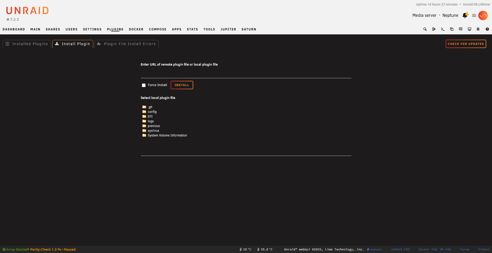
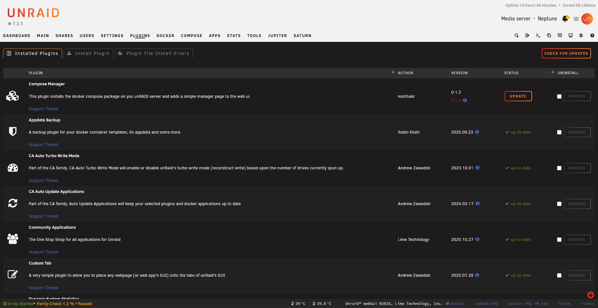
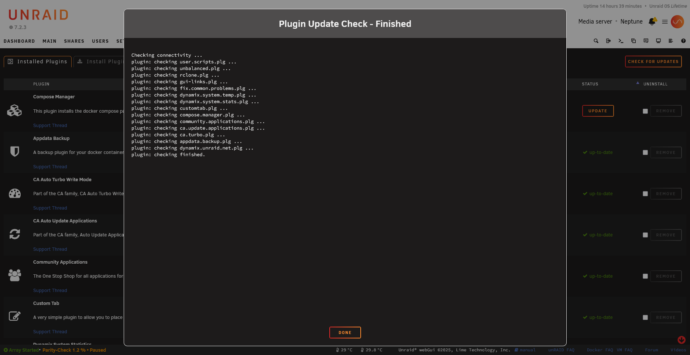
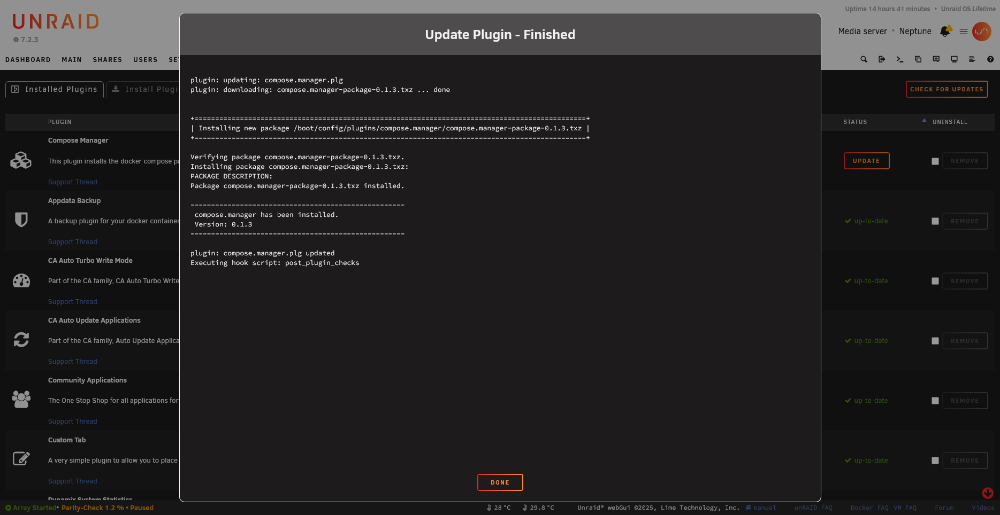

# Plugin Command Reference

The `plugin` command is the CLI tool for managing Unraid plugins. It handles installation, updates, removal, and status checks.

```
Usage: plugin install PLUGIN-FILE [forced]
       plugin remove PLUGIN
       plugin check PLUGIN
       plugin checkall
       plugin update PLUGIN
       plugin [attribute name] PLUGIN-FILE
```

## Basic Usage

```bash
plugin <command> <plugin-file>
```

## Commands

### install

Install a plugin from a local file or URL:



```bash
# From URL
plugin install https://raw.githubusercontent.com/user/repo/main/myplugin.plg

# From local file
plugin install /path/to/myplugin.plg

# Force install (even if lower version)
plugin install /path/to/myplugin.plg forced
```

**What happens:**
1. Downloads the PLG file (if URL)
2. Processes all `<FILE>` elements with `install` method
3. Copies PLG to `/boot/config/plugins/`
4. Creates symlink in `/var/log/plugins/`

Install from URL:


Or upload a local file:


The file picker allows selecting local `.plg` files:

{: .crop-pluginsInstallFile-picker }

### remove

Remove an installed plugin:

```bash
plugin remove myplugin.plg
```

**What happens:**
1. Processes all `<FILE>` elements with `remove` method
2. Deletes symlink from `/var/log/plugins/`
3. Moves PLG to `/boot/config/plugins-removed/`

### check

Check if a newer version is available:

```bash
plugin check myplugin.plg
```

**What happens:**
1. Downloads PLG from `pluginURL` to `/tmp/plugins/`
2. Extracts and outputs the version string
3. Exits 0 if newer version available

### checkall

Check all installed plugins for updates:

```bash
plugin checkall
```

Runs `plugin check` for each plugin in `/var/log/plugins/`.



The update indicator appears next to plugins with newer versions:

{: .crop-update-badge }

After check completes, plugins with updates are highlighted:



### update

Update a plugin to the latest version:

```bash
plugin update myplugin.plg
```

**What happens:**
1. Looks for new PLG in `/tmp/plugins/`
2. Runs install method of new version
3. Replaces old PLG in `/boot/config/plugins/`
4. Updates symlink in `/var/log/plugins/`

> 💡 Run `plugin check` first to download the latest version



### Attribute Queries

Get any attribute from a PLG file:

```bash
# Get version
plugin version /var/log/plugins/myplugin.plg

# Get author
plugin author /var/log/plugins/myplugin.plg

# Get any attribute
plugin pluginURL /var/log/plugins/myplugin.plg
```

## Directory Reference

| Directory | Purpose |
|-----------|---------|
| `/boot/config/plugins/` | Active plugin PLG files |
| `/boot/config/plugins-error/` | Failed installations |
| `/boot/config/plugins-removed/` | Uninstalled plugins |
| `/boot/config/plugins-stale/` | Superseded versions |
| `/tmp/plugins/` | Downloaded updates |
| `/var/log/plugins/` | Symlinks to installed plugins |

## Practical Examples

### Full Update Workflow

```bash
# Check for updates
plugin check myplugin.plg

# If update available, install it
plugin update myplugin.plg
```

### List Installed Plugins

The `/var/log/plugins/` directory contains symlinks to all installed plugins. Listing this directory shows you what's currently installed on the system.

```bash
ls -la /var/log/plugins/
```

### Check Plugin Version

Query the installed version of any plugin by passing its PLG file path to `plugin version`. This reads the version attribute from the PLG file's XML header.

```bash
plugin version /var/log/plugins/myplugin.plg
```

### Reinstall a Plugin

To reinstall a plugin cleanly, first remove it (which moves the PLG to `plugins-removed/`), then install from that backup location. This is useful for troubleshooting or resetting a plugin to its default state.

```bash
# Remove first
plugin remove myplugin.plg

# Then install fresh
plugin install /boot/config/plugins-removed/myplugin.plg
```

### Debug Installation

Capture both stdout and stderr during installation for troubleshooting. The `tee` command displays output in real-time while also saving it to a log file for later review.

```bash
plugin install myplugin.plg 2>&1 | tee /tmp/install.log
```

## Error Handling

### Plugin Moved to plugins-error

Installation failed. Check:
1. MD5 checksum mismatches
2. Download failures
3. Script errors
4. Missing dependencies

### Plugin Moved to plugins-stale

A newer version is already installed. Use `forced` flag if needed:

```bash
plugin install myplugin.plg forced
```

### Update Not Working

Ensure `pluginURL` attribute is set in your PLG:

```xml
<PLUGIN ... pluginURL="https://raw.githubusercontent.com/user/repo/main/myplugin.plg">
```

## Scripting with Plugin Command

### Check All Updates in Script

```bash
#!/bin/bash
for plg in /var/log/plugins/*.plg; do
    name=$(basename "$plg")
    echo "Checking $name..."
    if plugin check "$name" >/dev/null 2>&1; then
        echo "  Update available!"
    fi
done
```

### Get Plugin Info

```bash
#!/bin/bash
PLG="/var/log/plugins/myplugin.plg"
echo "Plugin: $(plugin name $PLG)"
echo "Version: $(plugin version $PLG)"
echo "Author: $(plugin author $PLG)"
```

## Notes

- The `plugin` command is specific to Unraid
- Plugins use Slackware's package format (`.txz`)
- The `upgradepkg` and `removepkg` commands handle package operations
- Always test plugins on a non-production server first

## See Also

- [PLG File Reference](plg-file)
- [Build and Packaging](build-and-packaging)

## Full Command Reference

<details markdown="block">
<summary>Complete <code>plugin</code> command help output</summary>

```
Process plugin files.

Usage: plugin install PLUGIN-FILE [forced]
  install a plugin

  PLUGIN-FILE is a plugin definition XML file with ".plg" extension.

  PLUGIN-FILE can be a local file, or a URL.  If a URL, the plugin file is first downloaded to /tmp/plugins.

  forced is optional and can be used to install a lower version than currently running.

  This command will process all FILE elements in PLUGIN-FILE which are tagged with the "install" method (or
  that have no method tag).

  This command has two major use cases:

  1) Invoked at system startup by /etc/rc.d/rc.local on each .plg file found int /boot/config/plugins.

     Upon success we register the plugin as "installed" by creating a symlink to it in /var/log/plugins.

     If any kind of error, we move the file to /boot/config/plugins-error.

     If a symlink already exists for the plugin file, this indicates a plugin replacing a "built-in" plugin.  In
     this case, if the version of PLUGIN-FILE is newer than the built-in plugin, we go ahead and install normally;
     otherwise, we move to /boot/config/plugins-stale.

  2) Invoked manually or via Plugin Manager for a .plg file not in /boot/config/plugins.

     If a symlink already exists for the plugin file, this indicates a plugin update. In this case, if the version of
     PLUGIN-FILE is newer than the built-in plugin, we go ahead and install normally and then move the old plugin
     to /boot/config/plugins-stale.

     Upon success we copy PLUGIN-FILE to /boot/config/plugins and register it as "installed" by creating a
     symlink to it in /var/log/plugins.

Usage: plugin remove PLUGIN
  remove a plugin

  PLUGIN is the file basename of a plugin, e.g., "myplugin.plg".

  If PLUGIN is found in /var/log/plugins then this command will process all FILE elements in PLUGIN which are
  tagged with the "remove" method.  Upon success we delete /var/log/plugins/PLUGIN and move the plugin
  file to /boot/config/plugins-removed

Usage: plugin check PLUGIN
  check and output the latest version of PLUGIN

  We extract the pluginURL attribute from PLUGIN and use it to download (presumably the latest
  version of) the plugin file to /tmp/plugins/ directory, and then output the version string.

Usage: plugin checkall
  check all installed plugins

  Runs 'plugin check PLUGIN' for each plugin file linked-to in /var/log/plugins.

Usage: plugin update PLUGIN
  update the plugin

  We look for the new plugin in /tmp/plugins/ directory.  If found then we first execute the "install"
  method of each FILE in the new plugin.  (If necessary, a plugin can detect that this is an
  "update" by checking for the existence of /var/log/plugins/PLUGIN.)  If successful, we
  delete the "old" plugin file from /boot/config/plugins/, copy the "new" plugin file from
  /tmp/plugins/ to /boot/config/plugins/, and finally create the new symlink.

  Note: to support `plugin check` and `plugin update` the plugin file must contain both "pluginURL" and
  "version" attributes.

Usage: plugin [attribute name] PLUGIN-FILE

Any method which is not one of the actions listed above is assumed to be the name of an attribute of
the <PLUGIN> tag within PLUGIN-FILE.  If the attribute exists, its value (a string) is output and the command
exit status is 0.  If the attribute does not exist, command exit status is 1.

The plugin manager recognizes this set of attributes for the <PLUGIN> tag:

name - MANDATORY plugin name, e.g., "myplugin" or "my-plugin" etc.
  This tag defines the name of the plugin.  The name should omit embedded information such as architecture,
  version, author, etc.

  The plugin should create a directory under `/usr/local/emhttp/plugins` named after
  the plugin, e.g., `/usr/local/emhttp/plugins/myplugin`.  Any webGui pages, icons, README files, etc, should
  be created inside this directory.

  The plugin should also create a directory under `/boot/config/plugins` named after the plugin, e.g.,
  `/boot/config/plugins/myplugin`.  Here is where you store plugin-specific files such as a configuration
  file and icon file.  Note that this directory exists on the users USB Flash device and writes should be
  minimized.

  Upon successful installation, the plugin manager will copy the input plugin file to `/boot/config/plugins`
  on the users USB Flash device, and create a symlink in `/var/log/plugins` also named after the plugin,
  e.g., `/var/log/plugins/myplugin`.  Each time the unRaid server is re-booted, all plugins stored
  in `/boot/config/plugins` are automatically installed; plugin authors should be aware of this behavior.

author - OPTIONAL
  Whatever you put here will show up under the **Author** column in the Plugin List.  If this attribute
  is omitted we display "anonymous".

version - MANDATORY
  Use a string suitable for comparison to determine if one version is older/same/newer than another version.
  Any format is acceptable but LimeTech uses "YYYY.MM.DD", e.g., "2014.02.18" (if multiple versions happen
  to get posted on the same day we add a letter suffix, e.g., "2014.02.18a").

pluginURL - OPTIONAL but MANDATORY if you want "check for updates" to work with your plugin
  This is the URL of the plugin file to download and extract the **version** attribute from to determine if
  this is a new version.

More attributes may be defined in the future.

Here is the set of directories and files used by the plugin system:

/boot/config/plugins/
  This directory contains the plugin files for plugins to be (re)installed at boot-time. Upon
  successful `plugin install`, the plugin file is copied here (if not here already).  Upon successful
  `plugin remove`, the plugin file is deleted from here.

/boot/config/plugins-error/
  This directory contains plugin files that failed to install.

/boot/config/plugins-removed/
  This directory contains plugin files that have been removed.

/boot/config/plugins-stale/
  This directory contains plugin files that failed to install because a newer version of the same plugin is
  already installed.

/tmp/plugins/
  This directory is used as a target for downloaded plugin files.  The `plugin check` operation
  downloads the plugin file here and the `plugin update` operation looks for the plugin to update here.

/var/log/plugins/
  This directory contains a symlink named after the plugin name (not the plugin file name) which points to
  the actual plugin file used to install the plugin.  The existence of this file indicates successful
  install of the plugin.
```

</details>
