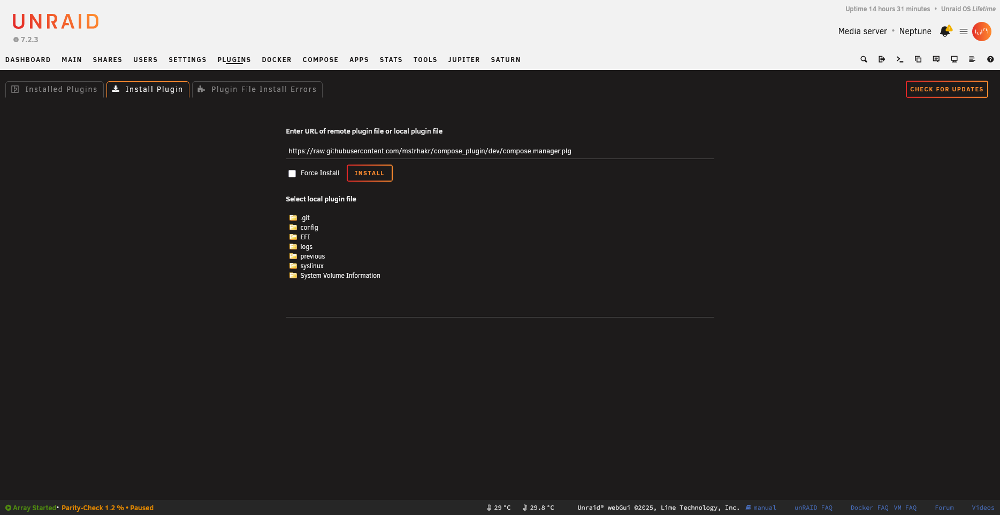

# Form Controls

## Overview

Unraid uses consistent form styling throughout its web interface. Following these patterns ensures your plugin integrates seamlessly with the Unraid look and feel.

Here's an example of Unraid's input field styling:

{: .crop-pluginsInstallUrl-input }

{: .placeholder-image }
> 📷 **Screenshot needed:** *A plugin settings page showing form styling*
>
> 

## Basic Form Structure

```html
<form method="POST" action="/update.php">
    <input type="hidden" name="csrf_token" value="<?=$var['csrf_token']?>">
    
    <dl>
        <dt>Setting Name:</dt>
        <dd><input type="text" name="setting" value="<?=$cfg['setting']?>"></dd>
    </dl>
    
    <dl>
        <dt>&nbsp;</dt>
        <dd><input type="submit" value="Apply"></dd>
    </dl>
</form>
```

## Form Layout Structure

Unraid uses `<dl>`, `<dt>`, `<dd>` elements for form layout:

- `<dl>` - Definition list (form row container)
- `<dt>` - Definition term (label column)
- `<dd>` - Definition description (input column)

```html
<form method="POST" action="/update.php">
    <input type="hidden" name="csrf_token" value="<?=$var['csrf_token']?>">
    
    <!-- Form row with label and input -->
    <dl>
        <dt>Label:</dt>
        <dd>
            <input type="text" name="field">
        </dd>
    </dl>
    
    <!-- Multi-input row -->
    <dl>
        <dt>Date/Time:</dt>
        <dd>
            <input type="date" name="date">
            <input type="time" name="time">
        </dd>
    </dl>
    
    <!-- Button row (empty label) -->
    <dl>
        <dt>&nbsp;</dt>
        <dd>
            <input type="submit" value="Apply">
            <input type="button" value="Done" onclick="done()">
        </dd>
    </dl>
</form>
```

## Text Input

```html
<dl>
    <dt>Text Setting:</dt>
    <dd>
        <input type="text" name="text_setting" value="<?=$cfg['text_setting']?>" 
               placeholder="Enter value">
    </dd>
</dl>

<!-- With size and maxlength -->
<dl>
    <dt>Short Code:</dt>
    <dd>
        <input type="text" name="code" value="<?=$cfg['code']?>" 
               size="10" maxlength="6">
    </dd>
</dl>

<!-- Read-only display -->
<dl>
    <dt>Version:</dt>
    <dd>
        <input type="text" value="<?=$version?>" readonly>
    </dd>
</dl>
```

## Toggle Switch (Yes/No)

The standard Unraid toggle is a styled select dropdown:

```html
<dl>
    <dt>Enable Feature:</dt>
    <dd>
        <select name="enabled">
            <option value="yes" <?=($cfg['enabled']=='yes')?'selected':''?>>Yes</option>
            <option value="no" <?=($cfg['enabled']=='no')?'selected':''?>>No</option>
        </select>
    </dd>
</dl>
```

### Custom Toggle Switch (CSS-based)

```html
<dl>
    <dt>Enable Feature:</dt>
    <dd>
        <input type="checkbox" id="enabled" name="enabled" value="yes"
               <?=($cfg['enabled']=='yes')?'checked':''?>>
        <label class="switch" for="enabled"></label>
    </dd>
</dl>

<style>
.switch {
    position: relative;
    display: inline-block;
    width: 40px;
    height: 20px;
    background: #ccc;
    border-radius: 20px;
    cursor: pointer;
}
.switch::after {
    content: '';
    position: absolute;
    width: 16px;
    height: 16px;
    border-radius: 50%;
    background: white;
    top: 2px;
    left: 2px;
    transition: left 0.2s;
}
input:checked + .switch {
    background: #4caf50;
}
input:checked + .switch::after {
    left: 22px;
}
input[type="checkbox"] {
    display: none;
}
</style>
```

{: .placeholder-image }
> 📷 **Screenshot needed:** *Toggle switch styles in Unraid*
>
> 

## Dropdown Select

```html
<dl>
    <dt>Choose Option:</dt>
    <dd>
        <select name="option">
            <option value="opt1" <?=($cfg['option']=='opt1')?'selected':''?>>Option 1</option>
            <option value="opt2" <?=($cfg['option']=='opt2')?'selected':''?>>Option 2</option>
            <option value="opt3" <?=($cfg['option']=='opt3')?'selected':''?>>Option 3</option>
        </select>
    </dd>
</dl>
```

### Dynamic Select with PHP

```php
<dl>
    <dt>Select Share:</dt>
    <dd>
        <select name="share">
            <option value="">Select...</option>
            <?
            $shares = parse_ini_file('/var/local/emhttp/shares.ini', true);
            foreach ($shares as $name => $info):
            ?>
            <option value="<?=$name?>" <?=($cfg['share']==$name)?'selected':''?>><?=$name?></option>
            <? endforeach; ?>
        </select>
    </dd>
</dl>
```

## Share Selector

For selecting Unraid shares:

{: .placeholder-image }
> 📷 **Screenshot needed:** *Share selector dropdown*
>
> 

```php
<?
$shares = parse_ini_file('/var/local/emhttp/shares.ini', true);
?>
<dl>
    <dt>Share:</dt>
    <dd>
        <select name="share">
            <option value="">None</option>
            <? foreach ($shares as $name => $info): ?>
            <option value="<?=$name?>" <?=($cfg['share']==$name)?'selected':''?>><?=$name?></option>
            <? endforeach; ?>
        </select>
    </dd>
</dl>
```

## Disk Selector

For selecting array disks:

```php
<?
$disks = parse_ini_file('/var/local/emhttp/disks.ini', true);
?>
<dl>
    <dt>Disk:</dt>
    <dd>
        <select name="disk">
            <option value="">Select disk...</option>
            <? foreach ($disks as $name => $info): 
                if (strpos($name, 'disk') !== 0) continue;  // Only array disks
                if (empty($info['device'])) continue;       // Skip unassigned slots
            ?>
            <option value="<?=$name?>" <?=($cfg['disk']==$name)?'selected':''?>>
                <?=$name?> (<?=$info['device']?> - <?=$info['id'] ?? 'Unknown'?>)
            </option>
            <? endforeach; ?>
        </select>
    </dd>
</dl>
```

## Path/Directory Input with Browser

```html
<dl>
    <dt>Path:</dt>
    <dd>
        <input type="text" id="path" name="path" value="<?=$cfg['path']?>" 
               placeholder="/mnt/user/...">
        <input type="button" value="Browse..." onclick="openFileBrowser(this, 'path', '/mnt/user', true)">
    </dd>
</dl>

<script>
// Simple file browser implementation
function openFileBrowser(button, inputId, startPath, dirsOnly) {
    var currentPath = document.getElementById(inputId).value || startPath;
    // You would implement or call Unraid's file picker here
    // This is a placeholder - actual implementation depends on your needs
}
</script>
```

### Using Unraid's Built-in File Tree

```html
<dl>
    <dt>Select Path:</dt>
    <dd>
        <input type="text" id="path" name="path" value="<?=$cfg['path']?>">
        <input type="button" value="..." onclick="openFileTree()">
    </dd>
</dl>

<!-- File tree container -->
<div id="fileTree" style="display:none; max-height:300px; overflow:auto; border:1px solid #ccc; padding:10px;">
</div>

<script src="/webGui/javascript/jqueryFileTree.js"></script>
<script>
function openFileTree() {
    var $tree = $('#fileTree');
    if ($tree.is(':visible')) {
        $tree.hide();
        return;
    }
    $tree.show().fileTree({
        root: '/mnt/user/',
        script: '/webGui/include/FileList.php',
        multiFolder: false,
        filter: 'HIDE_FILES_FILTER'
    }, function(file) {
        $('#path').val(file);
        $tree.hide();
    });
}
</script>
```

{: .placeholder-image }
> 📷 **Screenshot needed:** *File tree picker expanded*
>
> 

## Textarea

```html
<dl>
    <dt>Description:</dt>
    <dd>
        <textarea name="description" rows="5" cols="50"><?=$cfg['description']?></textarea>
    </dd>
</dl>

<!-- Code/script input with monospace font -->
<dl>
    <dt>Script:</dt>
    <dd>
        <textarea name="script" rows="10" style="font-family: monospace; width: 100%;"><?=$cfg['script']?></textarea>
    </dd>
</dl>
```

## Password Input

```html
<dl>
    <dt>Password:</dt>
    <dd>
        <input type="password" name="password" value="">
    </dd>
</dl>

<!-- Password with show/hide toggle -->
<dl>
    <dt>API Key:</dt>
    <dd>
        <input type="password" id="apikey" name="apikey" value="<?=$cfg['apikey']?>">
        <span class="fa fa-eye" onclick="togglePassword('apikey')" style="cursor:pointer;"></span>
    </dd>
</dl>

<script>
function togglePassword(id) {
    var input = document.getElementById(id);
    input.type = (input.type === 'password') ? 'text' : 'password';
}
</script>
```

## Checkbox

```html
<dl>
    <dt>Options:</dt>
    <dd>
        <label>
            <input type="checkbox" name="option1" value="yes" 
                   <?=($cfg['option1']=='yes')?'checked':''?>>
            Enable Option 1
        </label>
    </dd>
</dl>

<!-- Multiple checkboxes (array) -->
<dl>
    <dt>Select Days:</dt>
    <dd>
        <?
        $days = ['Mon', 'Tue', 'Wed', 'Thu', 'Fri', 'Sat', 'Sun'];
        $selected = explode(',', $cfg['days'] ?? '');
        foreach ($days as $day):
        ?>
        <label style="margin-right: 10px;">
            <input type="checkbox" name="days[]" value="<?=$day?>"
                   <?=in_array($day, $selected)?'checked':''?>>
            <?=$day?>
        </label>
        <? endforeach; ?>
    </dd>
</dl>
```

## Radio Buttons

```html
<dl>
    <dt>Mode:</dt>
    <dd>
        <label style="margin-right: 15px;">
            <input type="radio" name="mode" value="auto" 
                   <?=($cfg['mode']=='auto')?'checked':''?>>
            Automatic
        </label>
        <label style="margin-right: 15px;">
            <input type="radio" name="mode" value="manual" 
                   <?=($cfg['mode']=='manual')?'checked':''?>>
            Manual
        </label>
        <label>
            <input type="radio" name="mode" value="disabled" 
                   <?=($cfg['mode']=='disabled')?'checked':''?>>
            Disabled
        </label>
    </dd>
</dl>
```

## Number Input

```html
<dl>
    <dt>Interval (seconds):</dt>
    <dd>
        <input type="number" name="interval" value="<?=$cfg['interval']?>" 
               min="1" max="3600" step="1">
    </dd>
</dl>

<!-- With spinner controls -->
<dl>
    <dt>Port:</dt>
    <dd>
        <input type="number" name="port" value="<?=$cfg['port'] ?? 8080?>" 
               min="1" max="65535">
    </dd>
</dl>
```

## Slider/Range Input

```html
<dl>
    <dt>Volume:</dt>
    <dd>
        <input type="range" id="volume" name="volume" 
               value="<?=$cfg['volume'] ?? 50?>" 
               min="0" max="100" step="5"
               oninput="updateVolumeDisplay(this.value)">
        <span id="volumeDisplay"><?=$cfg['volume'] ?? 50?>%</span>
    </dd>
</dl>

<script>
function updateVolumeDisplay(val) {
    document.getElementById('volumeDisplay').textContent = val + '%';
}
</script>
```

## Button Styles

```html
<!-- Standard submit button (green) -->
<input type="submit" value="Apply">

<!-- Default/secondary button -->
<input type="button" value="Done" onclick="done()">

<!-- Button with icon -->
<button type="submit"><i class="fa fa-save"></i> Save</button>

<!-- Danger/delete button (use sparingly) -->
<input type="button" value="Delete" onclick="confirmDelete()" style="color: #fff; background: #d9534f;">

<!-- Disabled button -->
<input type="submit" value="Apply" disabled>
```

## Help Text and Tooltips

### Inline Help Text

```html
<dl>
    <dt>API Key:</dt>
    <dd>
        <input type="text" name="apikey" value="<?=$cfg['apikey']?>">
        <br><span class="helptext">Get your API key from Settings → API</span>
    </dd>
</dl>

<style>
.helptext {
    font-size: 0.85em;
    color: #888;
    font-style: italic;
}
</style>
```

### Title Attribute Tooltip

```html
<dl>
    <dt title="How often to check for updates">Interval:</dt>
    <dd>
        <input type="number" name="interval" value="<?=$cfg['interval']?>"
               title="Enter value between 1 and 3600 seconds">
    </dd>
</dl>
```

### Icon with Tooltip

```html
<dl>
    <dt>
        Setting 
        <i class="fa fa-question-circle" title="Detailed explanation of this setting"></i>
    </dt>
    <dd>
        <input type="text" name="setting" value="">
    </dd>
</dl>
```

## Conditional/Dynamic Fields

```html
<dl>
    <dt>Notification Type:</dt>
    <dd>
        <select name="notify_type" onchange="toggleNotifyOptions(this.value)">
            <option value="none" <?=($cfg['notify_type']=='none')?'selected':''?>>None</option>
            <option value="email" <?=($cfg['notify_type']=='email')?'selected':''?>>Email</option>
            <option value="webhook" <?=($cfg['notify_type']=='webhook')?'selected':''?>>Webhook</option>
        </select>
    </dd>
</dl>

<div id="emailOptions" style="display:<?=($cfg['notify_type']=='email')?'block':'none'?>;">
    <dl>
        <dt>Email Address:</dt>
        <dd><input type="email" name="email" value="<?=$cfg['email']?>"></dd>
    </dl>
</div>

<div id="webhookOptions" style="display:<?=($cfg['notify_type']=='webhook')?'block':'none'?>;">
    <dl>
        <dt>Webhook URL:</dt>
        <dd><input type="url" name="webhook_url" value="<?=$cfg['webhook_url']?>"></dd>
    </dl>
</div>

<script>
function toggleNotifyOptions(type) {
    document.getElementById('emailOptions').style.display = (type === 'email') ? 'block' : 'none';
    document.getElementById('webhookOptions').style.display = (type === 'webhook') ? 'block' : 'none';
}
</script>
```

## Form Layout Classes

```html
<!-- Narrow form (for simple settings) -->
<form class="narrow">
    ...
</form>

<!-- Wide/full-width form -->
<form style="max-width: none;">
    ...
</form>

<!-- Inline elements -->
<dl>
    <dt>Range:</dt>
    <dd class="inline">
        <input type="number" name="min" placeholder="Min" style="width:80px;">
        to
        <input type="number" name="max" placeholder="Max" style="width:80px;">
    </dd>
</dl>
```

## Common Form Patterns

### Settings Page Template

```php
Menu="Utilities"
Title="My Plugin Settings"
Icon="cog"
---
<?
$plugin = "yourplugin";
$cfg = parse_plugin_cfg($plugin);
$defaults = [
    'enabled' => 'no',
    'path' => '/mnt/user/appdata',
    'interval' => '60'
];
$cfg = array_merge($defaults, $cfg);
?>

<form method="POST" action="/update.php" target="progressFrame">
    <input type="hidden" name="csrf_token" value="<?=$var['csrf_token']?>">
    <input type="hidden" name="#file" value="<?=$plugin?>/<?=$plugin?>.cfg">
    
    <dl>
        <dt>Enable Plugin:</dt>
        <dd>
            <select name="enabled">
                <option value="yes" <?=($cfg['enabled']=='yes')?'selected':''?>>Yes</option>
                <option value="no" <?=($cfg['enabled']=='no')?'selected':''?>>No</option>
            </select>
        </dd>
    </dl>
    
    <dl>
        <dt>Data Path:</dt>
        <dd>
            <input type="text" name="path" value="<?=$cfg['path']?>">
        </dd>
    </dl>
    
    <dl>
        <dt>Check Interval:</dt>
        <dd>
            <input type="number" name="interval" value="<?=$cfg['interval']?>" min="1" max="3600"> seconds
        </dd>
    </dl>
    
    <dl>
        <dt>&nbsp;</dt>
        <dd>
            <input type="submit" value="Apply">
            <input type="button" value="Done" onclick="done()">
        </dd>
    </dl>
</form>
```

## Related Topics

- [CSRF Tokens](../core/csrf-tokens.md)
- [JavaScript Patterns](javascript-patterns.md)
- [Icons and Styling](icons-and-styling.md)
- [Plugin Settings Storage](../core/plugin-settings-storage.md)
