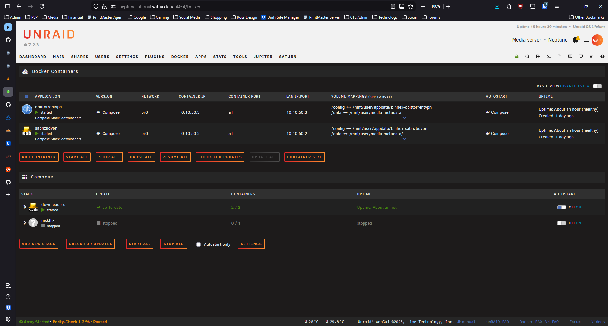

# Tab Pages

{: .note }
> ✅ **Validated against Unraid 7.2.3** - Menu structures and page types verified against live server.

## Overview

Complex plugins often need multiple configuration sections. Unraid provides a tab interface for organizing settings into logical groups.

Here's how Unraid's tab interface looks in the Plugins page:

{: .crop-pluginsInstalled-tabs }

Here's an example of a plugin adding a custom tab to an existing page:


*Compose Manager adds a "Compose" tab to the Docker page*

## Basic Tab Structure

Tabs consist of clickable tab headers and corresponding content panels. Use `data-tab` attributes to link headers with their content. Only one tab's content is visible at a time—JavaScript handles showing/hiding based on which tab is clicked.

```php
<?
// Tab page structure example
?>

<div class="tabs">
    <div class="tab" data-tab="general">General</div>
    <div class="tab" data-tab="advanced">Advanced</div>
    <div class="tab" data-tab="about">About</div>
</div>

<div class="tab-content" data-tab="general">
    <!-- General settings content -->
    <form method="POST">
        <input type="hidden" name="csrf_token" value="<?=$var['csrf_token']?>">
        <!-- Form fields -->
    </form>
</div>

<div class="tab-content" data-tab="advanced">
    <!-- Advanced settings content -->
</div>

<div class="tab-content" data-tab="about">
    <!-- About/info content -->
</div>
```

## JavaScript for Tabs

This jQuery code handles tab switching. When a tab is clicked, it adds the `active` class to highlight it, hides all content panels, then shows only the panel matching the clicked tab's `data-tab` value. The first tab is activated automatically on page load.

```javascript
$(function() {
    // Tab switching
    $('.tab').on('click', function() {
        var tabId = $(this).data('tab');
        
        // Update tab state
        $('.tab').removeClass('active');
        $(this).addClass('active');
        
        // Show content
        $('.tab-content').hide();
        $('.tab-content[data-tab="' + tabId + '"]').show();
    });
    
    // Activate first tab
    $('.tab:first').click();
});
```

## Page Header Attributes

Unraid® page files use header attributes to control menu placement, page type, and behavior. Here are the key attributes:

| Attribute | Description | Example |
|-----------|-------------|--------|
| `Menu` | Parent menu and sort order | `Menu="Docker:2"` |
| `Title` | Display name in menu/tab | `Title="Compose"` |
| `Type` | Page type (see below) | `Type="xmenu"` |
| `Icon` | Menu icon (icon class or path) | `Icon="cubes"` |
| `Tag` | Font Awesome icon for tabs | `Tag="fa-cubes"` |
| `Code` | Unicode for custom icon | `Code="f1b3"` |
| `Cond` | PHP condition for visibility | `Cond="$var['fsState'] == 'Started'"` |
| `Tabs` | Enable/disable tabs | `Tabs="true"` or `Tabs="false"` |
| `Lock` | Prevent menu movement | `Lock="true"` |

### Page Types

| Type | Purpose |
|------|--------|
| `xmenu` | Top-level navigation item (appears in header bar) |
| `menu` | Container page that groups child pages into panels |
| `php` | Standard PHP page (default if not specified) |

### The Tabs Attribute

The `Tabs` attribute controls whether child pages appear as tabs:

```
# Enable built-in tab interface
Menu="Tasks:60"
Type="xmenu"
Tabs="true"
---
```

When `Tabs="true"`, all pages with `Menu="ParentName:N"` appear as tabs. When `Tabs="false"`, child pages are listed but don't use the tab interface.

## Preserving Tab State

Save and restore the selected tab:

```javascript
$(function() {
    // Restore saved tab
    var savedTab = localStorage.getItem('yourplugin-tab');
    if (savedTab) {
        $('.tab[data-tab="' + savedTab + '"]').click();
    }
    
    // Save tab on change
    $('.tab').on('click', function() {
        localStorage.setItem('yourplugin-tab', $(this).data('tab'));
    });
});
```

## Tab-Specific Forms

Each tab can have its own form with independent submission:

```php
<div class="tab-content" data-tab="general">
    <form method="POST" action="/plugins/yourplugin/save-general.php">
        <input type="hidden" name="csrf_token" value="<?=$var['csrf_token']?>">
        <!-- General settings -->
        <input type="submit" value="Apply">
    </form>
</div>

<div class="tab-content" data-tab="network">
    <form method="POST" action="/plugins/yourplugin/save-network.php">
        <input type="hidden" name="csrf_token" value="<?=$var['csrf_token']?>">
        <!-- Network settings -->
        <input type="submit" value="Apply">
    </form>
</div>
```

## Multi-Page Tabs (Menu Numbering System)

Use separate `.page` files with the `Menu` attribute to create multi-tab pages. The format is:

```
Menu="ParentName:SortOrder"
```

- **ParentName** - The name of the parent page (without `.page` extension)
- **SortOrder** - Numeric value determining tab order (lower numbers appear first)

### Example: Adding a Tab to Docker

```
# compose.manager.page - Adds "Compose" tab to Docker page
Menu="Docker:2"
Title="Compose"
Type="php"
Cond="$var['fsState'] == 'Started' && exec('/etc/rc.d/rc.docker status | grep -v \"not\"')"
---
```

This creates a second tab on the Docker page (Docker Containers is at position 1).

### Sort Order Conventions

Lower numbers appear first (leftmost). Common patterns observed in Unraid®:

| Range | Usage |
|-------|-------|
| 1-10 | Primary/default tabs |
| 10-50 | Secondary features |
| 50-100 | Plugin additions |
| 100+ | Low-priority or conditional items |
| 999+ | "Other" or catch-all items |

{: .tip }
> Leave gaps between your sort numbers (e.g., use 10, 20, 30 instead of 1, 2, 3) to allow other plugins to insert tabs between yours.

## Styling Tabs

```css
.tabs {
    display: flex;
    border-bottom: 1px solid var(--border-color);
    margin-bottom: 20px;
}

.tab {
    padding: 10px 20px;
    cursor: pointer;
    border-bottom: 2px solid transparent;
}

.tab.active {
    border-bottom-color: var(--primary-color);
    font-weight: bold;
}

.tab-content {
    display: none;
}

.tab-content.active {
    display: block;
}
```

## Unraid® Menu Structure Reference

This reference documents all standard menu locations in Unraid® where plugins can add pages or tabs.

### Header Navigation Bar (Tasks)

The main navigation bar uses `Menu="Tasks:N"` with these standard positions:

| Position | Page | Description |
|----------|------|-------------|
| `Tasks:1` | Main, Dashboard | Array status and dashboard (shared position) |
| `Tasks:2` | Shares, Favorites | User shares and favorites (shared position) |
| `Tasks:3` | Users | User management (conditionally shown) |
| `Tasks:4` | Settings | System settings container |
| `Tasks:50` | Plugins | Plugin manager |
| `Tasks:60` | Docker | Docker container management |
| `Tasks:61` | *Available* | Compose Manager uses this for standalone menu |
| `Tasks:70` | VMs | Virtual machine management |
| `Tasks:80` | Apps | Community Applications |
| `Tasks:90` | Tools | System tools container |

{: .tip }
> Positions 1-4 are reserved for core Unraid® pages. Plugins should use positions 50+ to avoid conflicts.

### Settings Submenus

The Settings page (`Tasks:4`) contains these category panels:

| Menu | Title | Type | Description |
|------|-------|------|-------------|
| `Settings:1` | OtherSettings | menu | System Settings panel |
| `Settings:2` | NetworkServices | menu | Network Services panel |
| `Settings:3` | UserPreferences | menu | User Preferences panel |
| `Settings` | Utilities | menu | User Utilities panel (no number = alphabetical) |

### System Settings (OtherSettings)

Pages in the System Settings panel use `Menu="OtherSettings"`:

| Existing Pages | Your Plugin |
|---------------|-------------|
| CPU Pinning, Date and Time, Disk Settings, Docker, Global Share Settings, Identification, Management Access, Network Settings, Power Mode, VM Manager | Add with `Menu="OtherSettings"` |

### Network Services

Pages in the Network Services panel use `Menu="NetworkServices"` or `Menu="NetworkServices:N"`:

| Position | Page |
|----------|------|
| `NetworkServices:2` | NFS |
| `NetworkServices:3` | SMB (has sub-tabs) |
| `NetworkServices:999` | FTP Server |
| `NetworkServices` | VPN Manager, Outgoing Proxy, Syslog Server (no number = alphabetical) |

### User Utilities

Plugin settings pages commonly go here using `Menu="Utilities"`:

| Existing Pages |
|---------------|
| Community Applications, User Scripts, TurboWrite, Backup/Restore Appdata, Fix Common Problems, Stats Settings, System Temp, Custom Tab, rclone, etc. |

### User Preferences (UserPreferences)

User-specific settings use `Menu="UserPreferences"`:

| Existing Pages |
|---------------|
| Confirmations, Console Settings, Display Settings, Notification Settings, Scheduler |

### Tools Submenus

The Tools page (`Tasks:90`) contains:

| Menu | Title | Type |
|------|-------|------|
| `Tools:10` | UNRAID-OS | menu (Unraid OS utilities) |
| `Tools:20` | WebGui | menu (WebUI debugging tools) |
| `Tools:90` | About | menu (Credits, EULA) |
| `Tools` | System Information | menu (no number) |

### Unraid OS (UNRAID-OS)

System utilities use `Menu="UNRAID-OS"`:

| Existing Pages |
|---------------|
| Diagnostics, Hardware Profile, Log Viewer, New Config, New Permissions, Open Terminal, Processes, System Devices, System Drivers, System Log |

### About Menu

Documentation and system info use `Menu="About"` or `Menu="About:N"`:

| Position | Page |
|----------|------|
| `About:10` | Update OS |
| `About:20` | Downgrade OS |
| `About:30` | Registration |
| `About` | Credits, EULA (no number = alphabetical) |

### Adding Tabs to Existing Pages

These are common parent pages that support tabs:

| Parent | Your Menu Value | Example Use |
|--------|----------------|-------------|
| Docker | `Menu="Docker:N"` | Add compose/stack management |
| VMs | `Menu="VMs:N"` | Add VM-related features |
| Plugins | `Menu="Plugins"` | Plugin-related pages |
| SMB | `Menu="SMB:N"` | SMB configuration tabs |
| About | `Menu="About:N"` | System info pages |

### Conditional Menu Display

Use the `Cond` attribute to show/hide menu items based on system state:

```
# Only show when Docker is enabled and running
Cond="exec(\"grep -o '^DOCKER_ENABLED=.yes' /boot/config/docker.cfg 2>/dev/null\")"

# Only show when array is started
Cond="$var['fsState'] == 'Started'"

# Only show when a service is running
Cond="is_file('/var/run/dockerd.pid')"

# Combine conditions
Cond="$var['fsState'] == 'Started' && exec('/etc/rc.d/rc.docker status | grep -v \"not\"')"
```

### Dynamic Menu Placement

Some menus use PHP variables for conditional placement:

```
# Users menu - conditionally shown based on display setting
Menu="$display['users'] Tasks:3"
```

## Best Practices

- Keep related settings together
- Use clear, descriptive tab names
- Don't create too many tabs (3-5 is usually ideal)
- Consider user workflow when ordering tabs
- Save tab state for better UX
- Use unique, plugin-prefixed class names to avoid conflicts
- Scope your jQuery selectors to your container elements

## Adding Tabs to Existing Pages

Plugins can add new tabs to existing Unraid® pages (like the Docker page) using the `Menu` header in `.page` files. This creates a seamless integrated experience but requires careful attention to avoid conflicts.


*Example: Compose Manager adds a "Compose" tab to the Docker page*

### Selector Scoping

{: .warning }
> When your plugin adds a tab to an existing Unraid page, your JavaScript will run in the same context as the parent page's JavaScript. You **must** scope your CSS selectors to avoid conflicts.

Common classes like `.auto_start`, `.advanced`, `.basic`, and `.updatecolumn` are used by multiple Unraid pages. If your plugin uses these same classes and initializes jQuery plugins on them (like `switchButton`), you'll inadvertently reinitialize or modify elements that belong to the parent page.

**Problem - Unscoped selectors:**

```javascript
// BAD - This selects ALL .auto_start on the page, including Docker tab's checkboxes
$('.auto_start').switchButton({labels_placement:'right'});

// BAD - This toggles ALL .advanced elements, affecting Docker tab too  
$('.advanced').toggle();
```

**Solution - Scope to your container:**

```javascript
// GOOD - Only select checkboxes within your plugin's table
$('#my_plugin_table .auto_start').switchButton({labels_placement:'right'});

// GOOD - Only toggle your plugin's advanced columns
$('#my_plugin_table .advanced').toggle();
```

### Use Unique Class Names

Even with scoped selectors in your own code, Unraid's core pages use **unscoped selectors** that will still match your elements. For example, the Docker tab's JavaScript uses `$('tr.sortable')` and `$('.updatecolumn')` without scoping to its own container. If your plugin uses these class names, Docker's "Check for Updates" button will animate your plugin's rows too.

The only reliable solution is to use plugin-specific class names:

```html
<!-- BAD - Docker's unscoped JavaScript will target these -->
<tr class="sortable">
    <td class="updatecolumn">not checked</td>
</tr>

<!-- GOOD - Unique class names prevent cross-tab interference -->
<tr class="myplugin-sortable">
    <td class="myplugin-updatecolumn">not checked</td>
</tr>
```

For elements added to shared areas (like an Advanced View toggle in the tab bar), always use plugin-specific class names:

```javascript
// BAD - may conflict with Docker tab's advancedview toggle
$(".tabs").append('<span class="status"><input type="checkbox" class="advancedview"></span>');
$('.advancedview').switchButton({...});

// GOOD - unique class name avoids conflicts
$(".tabs").append('<span class="status myplugin-view-toggle"><input type="checkbox" class="myplugin-advancedview"></span>');
$('.myplugin-advancedview').switchButton({...});
```

### Initialization Timing

When adding a tab to an existing page, that page's JavaScript typically runs first and initializes its own UI components. Your plugin's async content loading can conflict if not properly scoped:

```javascript
// Load content asynchronously, then initialize
function loadMyPluginContent() {
    $.get('/plugins/myplugin/content.php', function(data) {
        $('#myplugin_content').html(data);
        
        // Initialize ONLY your plugin's elements
        $('#myplugin_content .auto_start').switchButton({...});
        $('#myplugin_content .auto_start').change(function(){
            // Handle change
        });
    });
}
```

## Related Topics

- [Page Files]()
- [Form Controls]()
- [JavaScript Patterns]() - See "Scope Your Selectors" and "Namespace Your CSS Classes"
- [Icons and Styling]() - See "Namespace Your Class Names"
