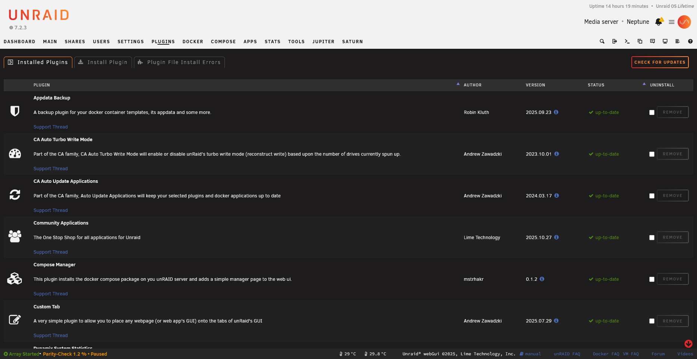

  

# Unraid Plugin Development Documentation

Welcome to the community-maintained documentation for building plugins for [Unraid OS](https://unraid.net/).

{: .warning }
> This is unofficial documentation maintained by the community. While we strive for accuracy, please verify critical information against official sources and existing plugins.

## Quick Start

New to plugin development? Start here:

1. [Introduction to Plugins]() - What are plugins and how do they work?
2. [Your First Plugin]() - Step-by-step tutorial
3. [PLG File Reference]() - The plugin installer format
4. [Page Files]() - Creating web UI pages

## Documentation Sections

### Getting Started
- [Introduction]() - Plugin system overview
- [File System Layout]() - Where files go and why
- [PLG File Reference]() - Plugin installer XML format
- [Page Files]() - Web UI development
- [Event System]() - Responding to system events

### Core Concepts
- [Dynamix Framework]() - The `$Dynamix` global array
- [Plugin Settings Storage]() - `.cfg` files and `parse_plugin_cfg()`
- [CSRF Tokens]() - Form security requirements
- [nchan/WebSocket]() - Real-time updates
- [Notifications System]() - User alerts
- [Cron Jobs]() - Scheduled tasks
- [rc.d Scripts]() - Service management
- [Multi-language Support]() - Translations

### UI Development
- [Form Controls]() - Standard form elements
- [JavaScript Patterns]() - jQuery and AJAX
- [Icons and Styling]() - Font Awesome and CSS
- [Tab Pages]() - Multi-tab interfaces
- [Dashboard Tiles]() - Custom dashboard tiles

### Advanced Topics
- [Docker Integration]() - Container management
- [Array/Disk Access]() - Disk and share info
- [User Scripts Integration]() - Working with User Scripts
- [Debugging Techniques]() - Logging and troubleshooting
- [Package Management]() - Building `.txz` packages
- [Update Mechanisms]() - Version checking and updates

### Security & Best Practices
- [Input Validation]() - Sanitizing user input
- [File Permissions]() - Correct permissions
- [Error Handling]() - Graceful failures

### Reference
- [Plugin Command]() - CLI tool usage
- [Build and Packaging]() - CI/CD pipelines
- [Example Plugins]() - Learn from real plugins
- [PHP Functions Reference]() - Available helpers
- [File Path Reference]() - Important directories
- [Event Types Reference]() - All event hooks

## Why This Documentation?

As noted in [this forum thread](https://forums.unraid.net/topic/52623-plugin-system-documentation/), official documentation for Unraid plugin development is scattered and incomplete. Most developers learn by:

- Reverse engineering existing plugins
- Asking questions in forums
- Trial and error

This project aims to consolidate that knowledge into a single, well-organized resource.

## Contributing

This documentation is open source! Found an error? Want to add content?

-  [View on GitHub](https://github.com/mstrhakr/unraid-plugin-docs)
-  [Report an Issue](https://github.com/mstrhakr/unraid-plugin-docs/issues)
- [Contributing Guide](CONTRIBUTING.md)

## Resources

- [Unraid Forums](https://forums.unraid.net/)
- [Official Unraid Docs](https://docs.unraid.net/)
- [Community Applications](https://github.com/Squidly271/community.applications)
